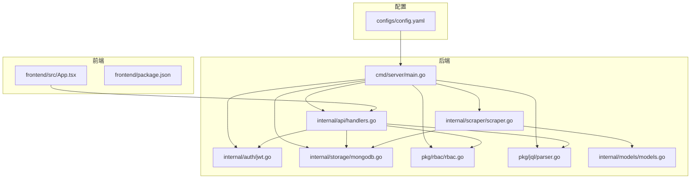
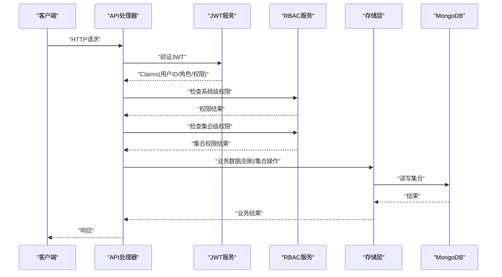
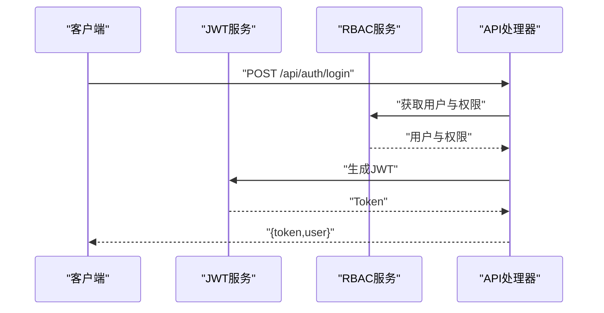
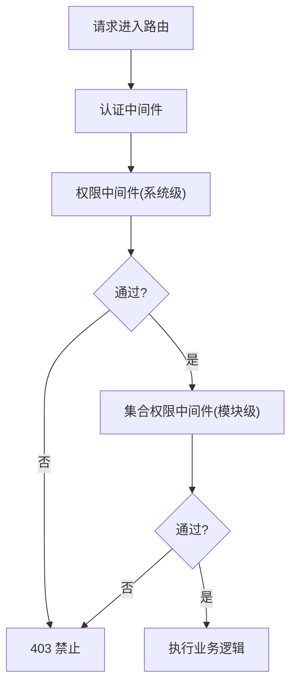
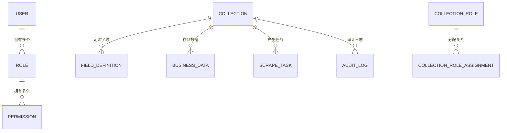
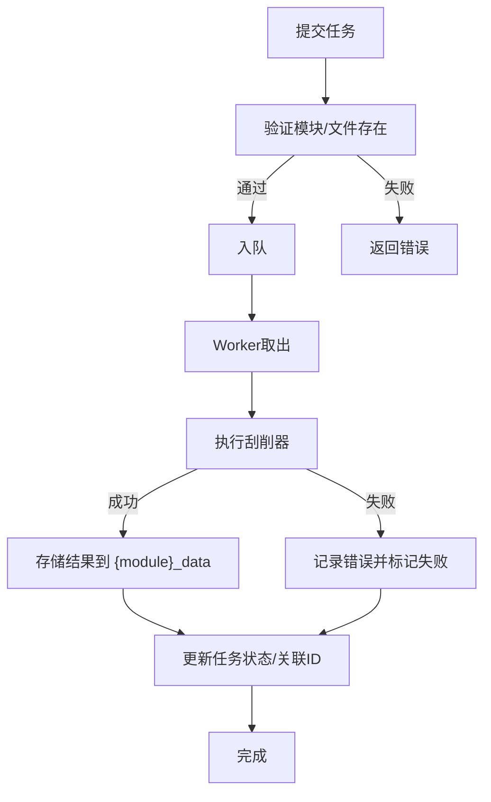
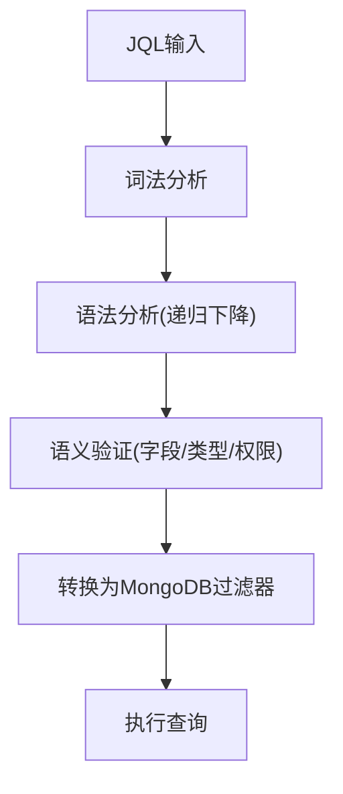
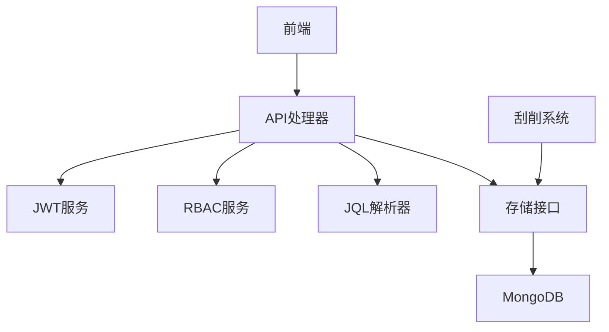

# 项目介绍

<cite>
**本文引用的文件**
- [README.md](file://README.md)
- [cmd/server/main.go](file://cmd/server/main.go)
- [configs/config.yaml](file://configs/config.yaml)
- [internal/models/models.go](file://internal/models/models.go)
- [pkg/rbac/rbac.go](file://pkg/rbac/rbac.go)
- [pkg/jql/parser.go](file://pkg/jql/parser.go)
- [internal/api/handlers.go](file://internal/api/handlers.go)
- [internal/auth/jwt.go](file://internal/auth/jwt.go)
- [internal/scraper/scraper.go](file://internal/scraper/scraper.go)
- [internal/storage/mongodb.go](file://internal/storage/mongodb.go)
- [frontend/src/App.tsx](file://frontend/src/App.tsx)
- [docs/architecture.md](file://docs/architecture.md)
- [docs/rbac.md](file://docs/rbac.md)
- [docs/business-data.md](file://docs/business-data.md)
- [docs/query.md](file://docs/query.md)
- [frontend/package.json](file://frontend/package.json)
</cite>

## 目录
1. [简介](#简介)
2. [项目结构](#项目结构)
3. [核心组件](#核心组件)
4. [架构总览](#架构总览)
5. [详细组件分析](#详细组件分析)
6. [依赖关系分析](#依赖关系分析)
7. [性能考量](#性能考量)
8. [故障排查指南](#故障排查指南)
9. [结论](#结论)
10. [附录](#附录)

## 简介
数据中心项目是一个基于 Go 与 React 的企业级数据管理平台，聚焦于“用户认证 + 双层 RBAC 权限 + 业务数据管理 + 数据刮削 + JQL 查询”的一体化解决方案。系统通过前后端分离架构，提供高并发、可扩展、可审计的企业数据中台能力，适用于需要灵活字段定义、模块化集合管理、异步数据采集与高级查询的业务场景。

- 核心目标与业务价值
  - 降低数据治理门槛：通过动态集合与字段定义，快速适配多变业务需求。
  - 强化权限管控：双层 RBAC（系统级 + 集合级）保障数据访问安全与合规。
  - 提升数据采集效率：异步刮削系统支持并发处理与重试机制，保障数据来源稳定。
  - 增强查询体验：JQL 查询语言提供类 SQL 的自然表达，兼顾安全与易用。

- 解决的实际问题
  - 传统系统字段固定、权限分散、查询复杂，难以满足多业务线并行发展。
  - 数据来源多样、格式不一，缺乏统一采集与质量控制。
  - 权限边界模糊导致越权访问风险，审计缺失影响合规追溯。

- 应用场景
  - 多业务线数据中台：统一管理不同模块（如电影、图书、音乐）的业务数据。
  - 数据采集与清洗：对接外部数据源，异步刮削并入库，支持重试与审计。
  - 权限驱动的协作：按模块划分 Owner/Operator/Tourist 角色，精细化授权。

**章节来源**
- [README.md:1-188](file://README.md#L1-L188)

## 项目结构
项目采用清晰的分层与模块化组织：
- 后端（cmd/server/main.go）：应用入口，负责环境变量加载、日志初始化、存储与服务初始化、路由注册与 HTTP 服务器启动。
- 内部包（internal/*）：API 处理器、认证（JWT）、日志中间件、数据模型、刮削系统、存储层（MongoDB）。
- 公共包（pkg/*）：RBAC 权限服务、JQL 查询解析器。
- 前端（frontend/src/App.tsx）：React + Ant Design + Zustand，提供管理后台页面与交互。
- 文档（docs/*）：架构、RBAC、业务数据、查询、日志等文档。

**图表来源**
- [cmd/server/main.go:1-167](file://cmd/server/main.go#L1-L167)
- [internal/api/handlers.go:1-1834](file://internal/api/handlers.go#L1-L1834)
- [internal/auth/jwt.go:1-126](file://internal/auth/jwt.go#L1-L126)
- [internal/scraper/scraper.go:1-289](file://internal/scraper/scraper.go#L1-L289)
- [internal/storage/mongodb.go:1-91](file://internal/storage/mongodb.go#L1-L91)
- [pkg/rbac/rbac.go:1-250](file://pkg/rbac/rbac.go#L1-L250)
- [pkg/jql/parser.go:1-653](file://pkg/jql/parser.go#L1-L653)
- [internal/models/models.go:1-365](file://internal/models/models.go#L1-L365)
- [frontend/src/App.tsx:1-69](file://frontend/src/App.tsx#L1-L69)
- [configs/config.yaml:1-26](file://configs/config.yaml#L1-L26)

**章节来源**
- [README.md:22-134](file://README.md#L22-L134)
- [docs/architecture.md:74-131](file://docs/architecture.md#L74-L131)

## 核心组件
- 用户认证系统（JWT）
  - 提供登录、注册、Token 生成与刷新、密码加密与校验。
  - 中间件链：CORS → 日志 → Recovery → 认证中间件 → 权限中间件 → 集合权限中间件。
- RBAC 权限管理（双层）
  - 系统级 RBAC：用户-角色-权限三层模型，支持通配符匹配与超级管理员。
  - 集合级 RBAC：模块粒度的 Owner/Operator/Tourist 三权分立。
- 业务数据管理
  - 动态集合 CRUD、软删除与恢复、字段定义与验证、审计日志。
- 数据刮削系统
  - 协程池 + Channel 队列，异步处理、状态跟踪、错误重试、结果入库。
- JQL 查询系统
  - 自定义查询语言，支持比较、逻辑、空值、IN/NOT IN、函数与括号分组，转换为 MongoDB 过滤器。

**章节来源**
- [internal/auth/jwt.go:1-126](file://internal/auth/jwt.go#L1-L126)
- [pkg/rbac/rbac.go:1-250](file://pkg/rbac/rbac.go#L1-L250)
- [internal/models/models.go:1-365](file://internal/models/models.go#L1-L365)
- [internal/scraper/scraper.go:1-289](file://internal/scraper/scraper.go#L1-L289)
- [pkg/jql/parser.go:1-653](file://pkg/jql/parser.go#L1-L653)
- [docs/architecture.md:39-51](file://docs/architecture.md#L39-L51)

## 架构总览
系统采用前后端分离与分层架构，后端以 Gin 为核心，MongoDB 作为数据存储，前端基于 React 生态。核心流程：
- 启动阶段：加载 .env 与 YAML 配置，初始化日志、业务与 RBAC 数据库、默认数据、刮削系统、JWT 与 RBAC 服务，注册路由并启动 HTTP 服务器。
- 请求阶段：CORS → 日志 → Recovery → 认证 → 权限 → 集合权限 → Handler → Service → Storage → MongoDB。
- 刮削阶段：API 提交任务 → 存储任务 → 入队 → Worker 取出 → 执行刮削器 → 存储结果 → 更新任务状态。

**图表来源**
- [cmd/server/main.go:24-150](file://cmd/server/main.go#L24-L150)
- [internal/api/handlers.go:45-181](file://internal/api/handlers.go#L45-L181)
- [internal/auth/jwt.go:68-83](file://internal/auth/jwt.go#L68-L83)
- [pkg/rbac/rbac.go:63-99](file://pkg/rbac/rbac.go#L63-L99)
- [internal/storage/mongodb.go:14-91](file://internal/storage/mongodb.go#L14-L91)

**章节来源**
- [docs/architecture.md:146-166](file://docs/architecture.md#L146-L166)
- [docs/architecture.md:255-267](file://docs/architecture.md#L255-L267)

## 详细组件分析

### 用户认证系统（JWT）
- 设计要点
  - Claims 包含 user_id、roles、permissions 与标准字段；支持签发、验证与刷新。
  - 密码使用 bcrypt 加密存储，响应中清除 password 字段。
  - 中间件链在 /api/* 上强制 JWT 验证，并注入用户上下文。
- 关键流程
  - 登录：校验凭据 → 查询用户 → 获取权限 → 生成 Token。
  - 注册：密码哈希 → 创建用户。
  - 刷新：允许过期 Token 在刷新窗口内刷新。

**图表来源**
- [internal/auth/jwt.go:44-66](file://internal/auth/jwt.go#L44-L66)
- [internal/api/handlers.go:183-221](file://internal/api/handlers.go#L183-L221)
- [pkg/rbac/rbac.go:116-145](file://pkg/rbac/rbac.go#L116-L145)

**章节来源**
- [internal/auth/jwt.go:1-126](file://internal/auth/jwt.go#L1-L126)
- [internal/api/handlers.go:260-293](file://internal/api/handlers.go#L260-L293)

### RBAC 权限管理（双层）
- 系统级 RBAC
  - 用户-角色-权限多对多，支持通配符匹配（如 user:*），超级管理员绕过所有检查。
- 集合级 RBAC
  - 每个模块自动创建 Owner/Operator/Tourist 三种角色，权限代码形如 {module}:read/write/delete/admin/field:admin。
  - 中间件在路由层拦截，根据 URL 参数或请求体中的 module 字段进行权限校验。
- API 中间件
  - PermissionMiddleware：全局权限检查。
  - CollectionPermissionMiddleware：集合权限检查。

**图表来源**
- [internal/api/handlers.go:295-314](file://internal/api/handlers.go#L295-L314)
- [pkg/rbac/rbac.go:63-99](file://pkg/rbac/rbac.go#L63-L99)

**章节来源**
- [pkg/rbac/rbac.go:1-250](file://pkg/rbac/rbac.go#L1-L250)
- [docs/rbac.md:1-482](file://docs/rbac.md#L1-L482)

### 业务数据管理
- 功能
  - 动态集合 CRUD、软删除与恢复、字段定义与验证、审计日志。
  - 支持按模块查询、分页、JQL 过滤。
- 数据模型
  - BusinessData、DeletedData、FieldDefinition、Collection、CollectionRole、CollectionRoleAssignment、AuditLog 等。
- 刮削集成
  - 刮削结果入库时自动合并属性（如 scrape_path、data_path、module、task_id、scraped_at），并对字段进行验证（非阻塞）。

**图表来源**
- [internal/models/models.go:227-365](file://internal/models/models.go#L227-L365)

**章节来源**
- [internal/models/models.go:1-365](file://internal/models/models.go#L1-L365)
- [docs/business-data.md:1-519](file://docs/business-data.md#L1-L519)

### 数据刮削系统
- 架构
  - SubmitTask → 存储任务 → 入队 → Worker 取出 → 执行刮削器 → 存储结果 → 更新任务状态。
  - 支持并发 Worker（默认 4）、队列缓冲（默认 1000）、失败重试、软删除与恢复。
- 处理流程
  - 验证模块存在 → 保存任务 → 入队 → 状态 pending → scraping → success/failed → 关联业务数据 ID。

**图表来源**
- [internal/scraper/scraper.go:74-193](file://internal/scraper/scraper.go#L74-L193)

**章节来源**
- [internal/scraper/scraper.go:1-289](file://internal/scraper/scraper.go#L1-L289)
- [docs/business-data.md:14-92](file://docs/business-data.md#L14-L92)

### JQL 查询系统
- 语法与运算符
  - 支持比较（=, !=, >, <, >=, <=）、逻辑（AND, OR, NOT）、空值（IS NULL, IS NOT NULL）、IN/NOT IN、正则（~）、括号分组。
  - 内置函数：CurrentUser、Now、StartOfDay/EndOfDay、StartOfWeek/EndOfWeek、StartOfMonth/EndOfMonth。
- 转换与安全
  - 解析为 AST，再转换为 MongoDB bson.M 过滤器；支持字段前缀转换（非系统字段自动加 custom_fields. 前缀）。
  - 通过白名单与类型验证防止注入与越权。
- API
  - GET /api/business/module/:module?jql=...&page=&pageSize=，POST /api/query/validate 校验语法。

**图表来源**
- [pkg/jql/parser.go:46-65](file://pkg/jql/parser.go#L46-L65)
- [pkg/jql/parser.go:268-421](file://pkg/jql/parser.go#L268-L421)

**章节来源**
- [pkg/jql/parser.go:1-653](file://pkg/jql/parser.go#L1-L653)
- [docs/query.md:1-300](file://docs/query.md#L1-L300)

## 依赖关系分析
- 组件耦合与协作
  - API 处理器依赖 JWT、RBAC、存储层、刮削系统与 JQL 解析器。
  - 存储层抽象（Storage 接口）屏蔽 MongoDB 实现差异，便于扩展。
  - 刮削系统与存储层双向交互：提交任务、更新状态、存储结果。
- 外部依赖
  - 后端：Gin、MongoDB Driver、JWT、bcrypt、zerolog、lumberjack、UUID。
  - 前端：React、Ant Design、Axios、React Router、Zustand。

**图表来源**
- [internal/api/handlers.go:23-43](file://internal/api/handlers.go#L23-L43)
- [internal/storage/mongodb.go:14-91](file://internal/storage/mongodb.go#L14-L91)
- [frontend/src/App.tsx:1-69](file://frontend/src/App.tsx#L1-L69)

**章节来源**
- [docs/architecture.md:52-73](file://docs/architecture.md#L52-L73)
- [frontend/package.json:12-28](file://frontend/package.json#L12-L28)

## 性能考量
- 并发与异步
  - 刮削系统使用协程池与 Channel 队列，支持配置并发 Worker 与队列缓冲。
- 查询优化
  - JQL 转换为 MongoDB 过滤器，结合索引策略与分页避免全表扫描。
- 日志与可观测性
  - zerolog + lumberjack，HTTP 请求日志与应用日志分离，支持轮转与保留策略。
- 安全与稳定性
  - Recovery 中间件捕获 panic；JWT 与 RBAC 双重防护；软删除与审计日志保障可恢复性。

**章节来源**
- [docs/architecture.md:664-697](file://docs/architecture.md#L664-L697)
- [docs/business-data.md:513-519](file://docs/business-data.md#L513-L519)
- [docs/query.md:140-159](file://docs/query.md#L140-L159)

## 故障排查指南
- 认证与权限
  - 401/403：检查 Authorization 头、Token 有效性、用户权限与集合权限。
  - 密码错误：确认 bcrypt 校验流程与接口响应中 password 字段清除。
- 刮削任务
  - 任务状态异常：检查 pending/scraping/success/failed 状态流转与错误信息。
  - 刮削器执行失败：核对 Python 脚本路径、数据文件路径与输出格式。
- 查询问题
  - JQL 语法错误：使用 /api/query/validate 接口验证；检查字段白名单与类型。
- 存储与索引
  - 集合不存在：确认模块集合创建与索引配置；检查 collections 与 {module}_data 集合。
- 日志定位
  - 查看 logs/http.log 与 logs/app.log，定位请求耗时、错误堆栈与刮削执行日志。

**章节来源**
- [internal/api/handlers.go:260-314](file://internal/api/handlers.go#L260-L314)
- [internal/scraper/scraper.go:122-193](file://internal/scraper/scraper.go#L122-L193)
- [docs/query.md:174-179](file://docs/query.md#L174-L179)
- [docs/business-data.md:426-485](file://docs/business-data.md#L426-L485)

## 结论
数据中心项目通过“认证 + 双层 RBAC + 业务数据 + 刮削 + 查询”的完整能力矩阵，为企业提供灵活、安全、高效的数字化基础设施。其优势体现在：
- 技术架构：Go + Gin + MongoDB 的高并发与高扩展性；前后端分离与中间件链保障安全与可观测性。
- 业务模式：模块化集合与动态字段定义，快速适配多业务线；双层 RBAC 精细化权限控制；JQL 降低查询门槛；异步刮削提升数据来源稳定性。
- 创新点：集合级角色与权限的自动化创建与分配；字段验证与非阻塞存储；JQL 到 MongoDB 的安全转换。

## 附录
- 配置与部署
  - 环境变量与 YAML 配置：数据库连接、JWT 密钥与有效期、日志参数、服务器端口与超时、刮削 Worker 数。
  - 前端依赖与构建：React + TypeScript + Vite + Ant Design + Zustand + Axios。
- 发展与规划（基于现有实现的演进建议）
  - 前端：引入更完善的权限可视化与审计日志展示；增强 JQL 语法提示与示例库。
  - 后端：引入缓存层（Redis）加速热点查询；增加查询超时与复杂度限制；完善刮削任务的重试策略与告警通知。
  - 安全：Token 刷新窗口策略优化；审计日志结构化与集中化存储；定期权限健康检查与自动回收。

**章节来源**
- [configs/config.yaml:1-26](file://configs/config.yaml#L1-L26)
- [cmd/server/main.go:50-69](file://cmd/server/main.go#L50-L69)
- [frontend/package.json:12-28](file://frontend/package.json#L12-L28)
- [docs/architecture.md:724-743](file://docs/architecture.md#L724-L743)