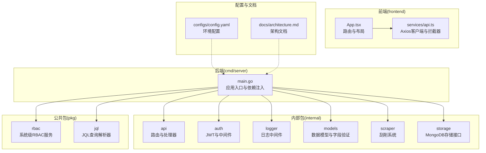
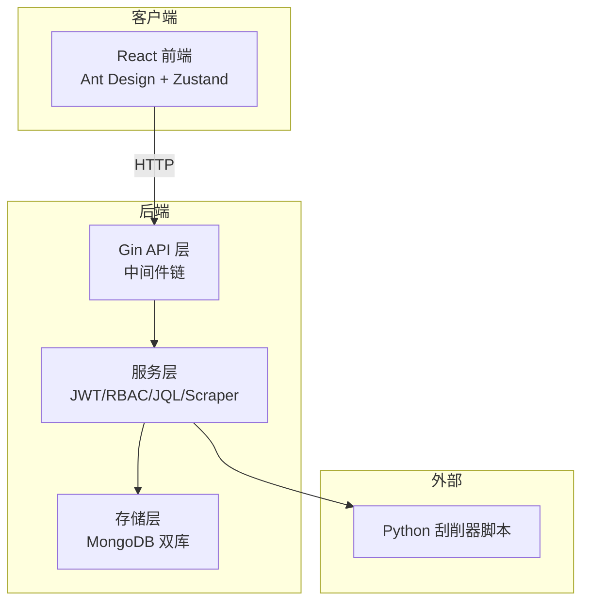
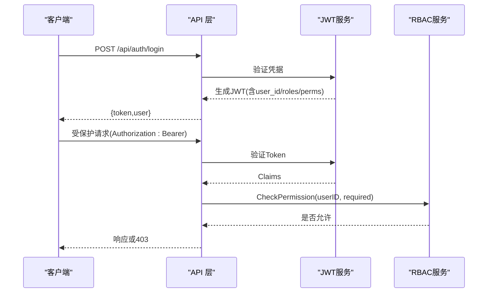
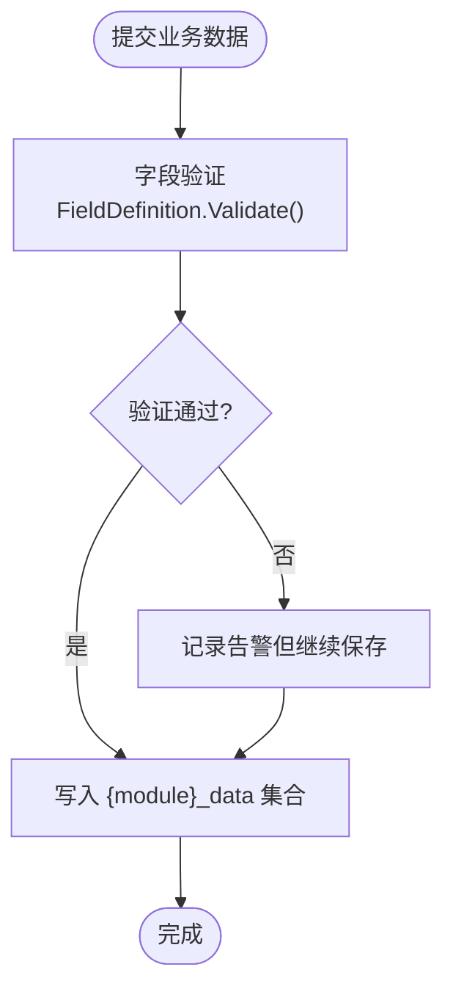
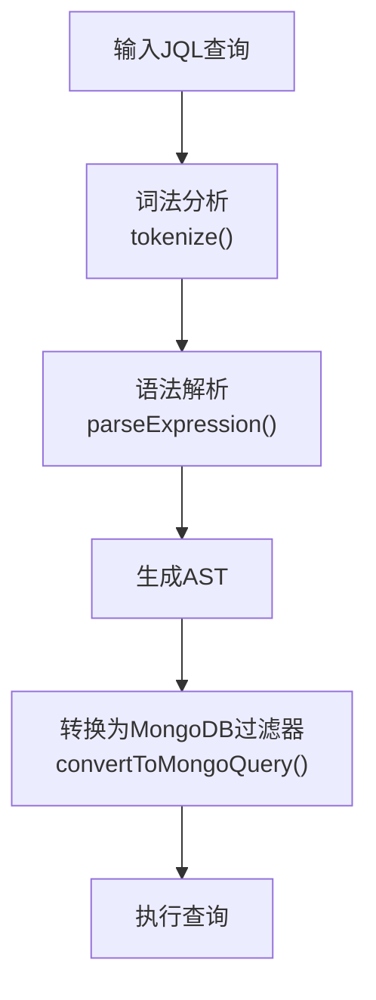
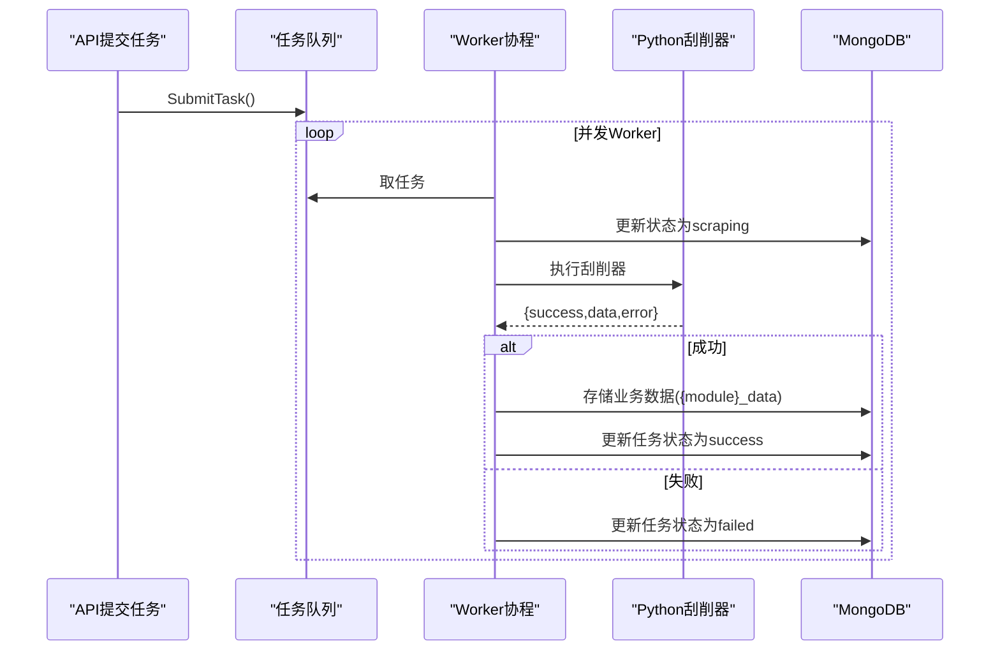
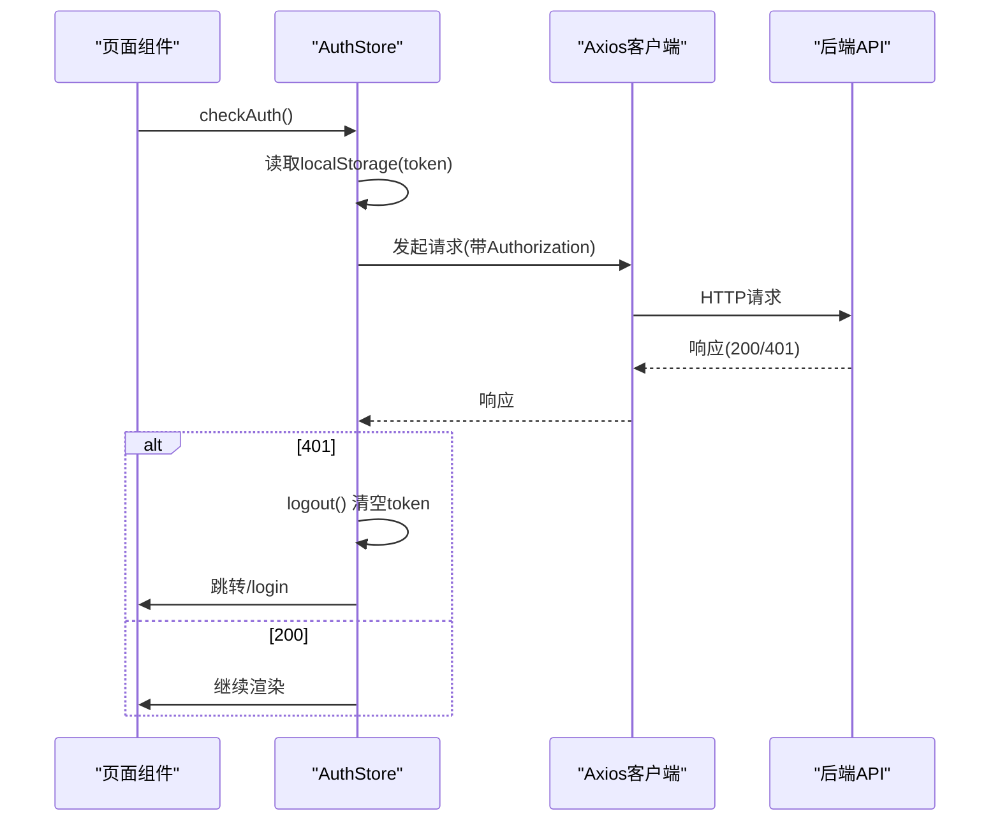
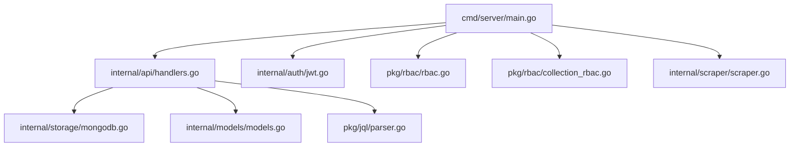

# 项目概述

<cite>
**本文档引用的文件**
- [README.md](file://README.md)
- [cmd/server/main.go](file://cmd/server/main.go)
- [internal/api/handlers.go](file://internal/api/handlers.go)
- [internal/models/models.go](file://internal/models/models.go)
- [pkg/rbac/rbac.go](file://pkg/rbac/rbac.go)
- [pkg/jql/parser.go](file://pkg/jql/parser.go)
- [internal/scraper/scraper.go](file://internal/scraper/scraper.go)
- [internal/storage/mongodb.go](file://internal/storage/mongodb.go)
- [frontend/src/App.tsx](file://frontend/src/App.tsx)
- [frontend/src/services/api.ts](file://frontend/src/services/api.ts)
- [configs/config.yaml](file://configs/config.yaml)
- [docs/architecture.md](file://docs/architecture.md)
- [docs/rbac.md](file://docs/rbac.md)
</cite>

## 目录
1. [简介](#简介)
2. [项目结构](#项目结构)
3. [核心组件](#核心组件)
4. [架构总览](#架构总览)
5. [详细组件分析](#详细组件分析)
6. [依赖分析](#依赖分析)
7. [性能考虑](#性能考虑)
8. [故障排查指南](#故障排查指南)
9. [结论](#结论)
10. [附录](#附录)

## 简介
数据中心项目是一个基于 Go 和 React 的企业级数据管理平台，提供用户认证、RBAC 权限管理、业务数据管理、数据刮削功能以及 JQL 查询系统。系统采用前后端分离架构，后端基于 Gin + MongoDB，前端基于 React + TypeScript + Ant Design，支持双层 RBAC（系统级 + 集合级）、动态集合管理、异步刮削任务、自定义字段验证与审计日志。

## 项目结构
项目采用模块化分层设计，后端以包为单位划分领域能力，前端以页面与服务层组织，文档集中沉淀架构与规范。

图表来源
- [cmd/server/main.go:1-167](file://cmd/server/main.go#L1-L167)
- [internal/api/handlers.go:1-1834](file://internal/api/handlers.go#L1-L1834)
- [frontend/src/App.tsx:1-69](file://frontend/src/App.tsx#L1-L69)
- [frontend/src/services/api.ts:1-37](file://frontend/src/services/api.ts#L1-L37)
- [configs/config.yaml:1-26](file://configs/config.yaml#L1-L26)
- [docs/architecture.md:1-834](file://docs/architecture.md#L1-L834)

章节来源
- [README.md:22-41](file://README.md#L22-L41)
- [docs/architecture.md:74-131](file://docs/architecture.md#L74-L131)

## 核心组件
- 应用入口与依赖注入：后端通过 main.go 完成日志、存储、RBAC、JWT、刮削系统与 API 路由的初始化编排。
- API 层：handlers.go 提供 RESTful 接口与中间件链，覆盖认证、用户、权限、角色、字段、业务数据、刮削、集合管理等。
- 认证与授权：JWT 服务负责签发与验证；RBAC 服务实现系统级与集合级权限检查。
- 数据模型与验证：models.go 定义业务模型与字段验证逻辑，支持多种字段类型与约束。
- JQL 查询：pkg/jql/parser.go 提供自定义查询语言解析，映射为 MongoDB 过滤器。
- 刮削系统：internal/scraper/scraper.go 基于协程池与通道的任务队列，异步执行外部刮削器脚本。
- 存储层：internal/storage/mongodb.go 定义统一存储接口，支撑业务数据、RBAC、集合与动态集合管理。
- 前端路由与服务：frontend/src/App.tsx 提供受保护路由与页面布局；services/api.ts 提供 Axios 客户端与拦截器。

章节来源
- [cmd/server/main.go:24-167](file://cmd/server/main.go#L24-L167)
- [internal/api/handlers.go:45-181](file://internal/api/handlers.go#L45-L181)
- [pkg/rbac/rbac.go:55-250](file://pkg/rbac/rbac.go#L55-L250)
- [pkg/jql/parser.go:46-653](file://pkg/jql/parser.go#L46-L653)
- [internal/scraper/scraper.go:18-289](file://internal/scraper/scraper.go#L18-L289)
- [internal/models/models.go:12-365](file://internal/models/models.go#L12-L365)
- [internal/storage/mongodb.go:14-91](file://internal/storage/mongodb.go#L14-L91)
- [frontend/src/App.tsx:19-69](file://frontend/src/App.tsx#L19-L69)
- [frontend/src/services/api.ts:5-37](file://frontend/src/services/api.ts#L5-L37)

## 架构总览
系统采用前后端分离的分层架构：
- 前端：React + TypeScript + Ant Design，Vite 构建，Axios 与 Zustand 状态管理。
- 后端：Gin 路由 + 中间件链 + Handler，MongoDB 双数据库（业务与RBAC）。
- 安全：JWT 认证、bcrypt 密码、CORS、Recovery 中间件与审计日志。
- 数据：动态集合管理、字段验证、软删除与恢复、刮削任务异步处理。

图表来源
- [docs/architecture.md:1-50](file://docs/architecture.md#L1-L50)
- [internal/api/handlers.go:45-181](file://internal/api/handlers.go#L45-L181)
- [internal/scraper/scraper.go:195-231](file://internal/scraper/scraper.go#L195-L231)
- [internal/storage/mongodb.go:14-91](file://internal/storage/mongodb.go#L14-L91)

章节来源
- [docs/architecture.md:52-73](file://docs/architecture.md#L52-L73)
- [README.md:5-21](file://README.md#L5-L21)

## 详细组件分析

### 认证与授权（JWT + RBAC）
- JWT 服务：生成与验证 Token，携带用户ID、角色与权限，支持刷新窗口。
- 系统级 RBAC：用户-角色-权限三层模型，支持通配符匹配与超级管理员。
- 集合级 RBAC：模块粒度权限控制，Owner/Operator/Tourist 三类角色，支持角色分配与审计。

图表来源
- [internal/api/handlers.go:183-221](file://internal/api/handlers.go#L183-L221)
- [internal/api/handlers.go:260-314](file://internal/api/handlers.go#L260-L314)
- [pkg/rbac/rbac.go:63-114](file://pkg/rbac/rbac.go#L63-L114)

章节来源
- [docs/architecture.md:356-414](file://docs/architecture.md#L356-L414)
- [pkg/rbac/rbac.go:10-53](file://pkg/rbac/rbac.go#L10-L53)

### 业务数据管理与字段验证
- 动态集合：按模块创建 {module}_data 集合，支持 CRUD 与分页。
- 字段定义：FieldDefinition 支持 string/number/boolean/date/array/object 及多种约束。
- 软删除：提供 deleted_data 与 deleted_scrape_tasks，支持恢复。

图表来源
- [internal/models/models.go:73-221](file://internal/models/models.go#L73-L221)
- [internal/scraper/scraper.go:233-288](file://internal/scraper/scraper.go#L233-L288)

章节来源
- [docs/architecture.md:48-51](file://docs/architecture.md#L48-L51)
- [internal/models/models.go:51-61](file://internal/models/models.go#L51-L61)

### JQL 查询系统
- 语法：支持比较、逻辑、IN/NOT IN、IS NULL/NOT NULL、括号分组与内置函数。
- 解析：递归下降解析器，将查询字符串转换为 MongoDB bson.M 过滤器。
- 使用：在业务数据查询中自动为非系统字段名添加 custom_fields. 前缀。

图表来源
- [pkg/jql/parser.go:46-653](file://pkg/jql/parser.go#L46-L653)

章节来源
- [docs/architecture.md:579-663](file://docs/architecture.md#L579-L663)
- [pkg/jql/parser.go:12-44](file://pkg/jql/parser.go#L12-L44)

### 刮削系统
- 架构：协程池 + Channel 队列，支持并发与优雅关闭。
- 生命周期：pending → scraping → success/failed，支持重试与结果落库。
- 集成：执行外部 Python 刮削器脚本，解析输出并存入对应模块集合。

图表来源
- [internal/scraper/scraper.go:74-193](file://internal/scraper/scraper.go#L74-L193)
- [internal/scraper/scraper.go:195-231](file://internal/scraper/scraper.go#L195-L231)
- [internal/scraper/scraper.go:233-288](file://internal/scraper/scraper.go#L233-L288)

章节来源
- [docs/architecture.md:481-578](file://docs/architecture.md#L481-L578)
- [internal/scraper/scraper.go:18-45](file://internal/scraper/scraper.go#L18-L45)

### 前端路由与服务
- 路由：受保护路由与公开登录页，使用 React Router v6。
- 服务：Axios 客户端封装 base URL、请求拦截器注入 Token、响应拦截器处理 401。
- 状态：Zustand 管理认证状态（token、user、login/logout）。

图表来源
- [frontend/src/App.tsx:19-31](file://frontend/src/App.tsx#L19-L31)
- [frontend/src/services/api.ts:10-35](file://frontend/src/services/api.ts#L10-L35)

章节来源
- [docs/architecture.md:744-798](file://docs/architecture.md#L744-L798)
- [frontend/src/App.tsx:1-69](file://frontend/src/App.tsx#L1-L69)
- [frontend/src/services/api.ts:1-37](file://frontend/src/services/api.ts#L1-L37)

## 依赖分析
- 后端依赖注入：main.go 显式构造 Handler，注入存储、JWT、RBAC、刮削系统等依赖，降低耦合。
- 中间件链：CORS → Logger → Recovery → AuthMiddleware → PermissionMiddleware → CollectionPermissionMiddleware。
- 存储接口：统一的 Storage 接口屏蔽业务与RBAC数据库差异，便于扩展与测试。

图表来源
- [cmd/server/main.go:94-95](file://cmd/server/main.go#L94-L95)
- [internal/api/handlers.go:23-43](file://internal/api/handlers.go#L23-L43)
- [internal/storage/mongodb.go:14-91](file://internal/storage/mongodb.go#L14-L91)

章节来源
- [cmd/server/main.go:94-119](file://cmd/server/main.go#L94-L119)
- [internal/api/handlers.go:45-181](file://internal/api/handlers.go#L45-L181)

## 性能考虑
- 后端：Gin 轻量高效，配合 zerolog 结构化日志与 lumberjack 轮转，减少 IO 开销。
- 存储：MongoDB 支持动态集合与索引，结合分页与 JQL 过滤提升查询效率。
- 刮削：协程池并发处理，Channel 缓冲队列避免阻塞，支持重试与失败回退。
- 前端：React 组件懒加载与 Suspense，减少首屏负载；Axios 超时与拦截器统一处理错误。

## 故障排查指南
- 认证失败：检查 Authorization 头是否为 Bearer Token，确认 JWT Secret 与过期时间配置。
- 权限不足：确认用户角色与权限分配，检查系统级与集合级权限代码是否匹配。
- 刮削失败：检查 Python 刮削器脚本路径与数据文件路径，查看任务状态与错误信息。
- 数据查询异常：验证 JQL 语法，确认字段名前缀转换逻辑与集合索引配置。
- 日志定位：查看 HTTP 请求日志与应用日志，关注错误堆栈与关键事件。

章节来源
- [internal/api/handlers.go:260-314](file://internal/api/handlers.go#L260-L314)
- [internal/scraper/scraper.go:195-231](file://internal/scraper/scraper.go#L195-L231)
- [pkg/jql/parser.go:649-653](file://pkg/jql/parser.go#L649-L653)
- [docs/architecture.md:664-697](file://docs/architecture.md#L664-L697)

## 结论
数据中心项目通过前后端分离、模块化与双层 RBAC 设计，实现了灵活的企业级数据管理能力。Go 的高性能与 React 的组件化开发相结合，辅以 MongoDB 的灵活性与 JQL 查询能力，满足复杂业务场景下的数据采集、治理与可视化需求。建议在生产环境中完善监控与告警、数据库备份与恢复策略，并持续优化查询与并发处理性能。

## 附录
- 环境变量与配置：参考 README 与 config.yaml，确保数据库、JWT、日志与刮削工作线程等参数正确。
- API 路由清单：详见 docs/architecture.md 的 API 全览与中间件链说明。
- RBAC 设计：系统级与集合级权限模型、角色与权限的多对多关系、审计日志与索引策略。

章节来源
- [README.md:50-63](file://README.md#L50-L63)
- [configs/config.yaml:1-26](file://configs/config.yaml#L1-L26)
- [docs/architecture.md:269-343](file://docs/architecture.md#L269-L343)
- [docs/rbac.md:1-482](file://docs/rbac.md#L1-L482)