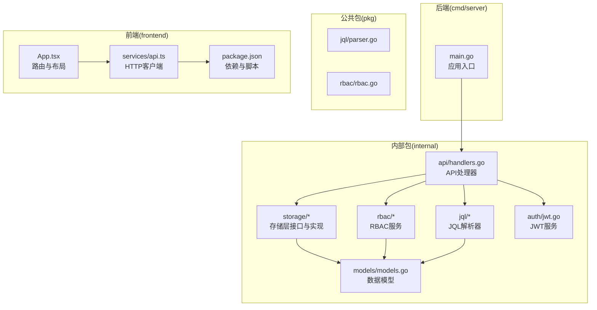
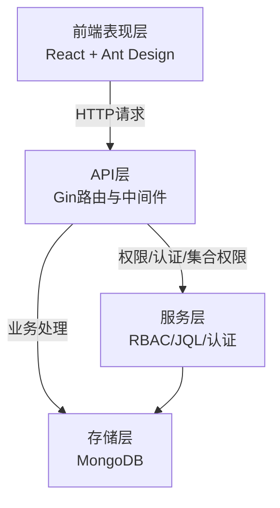
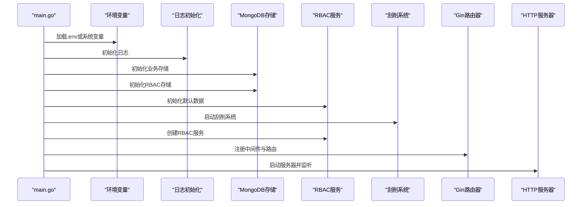
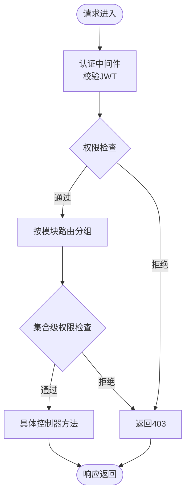
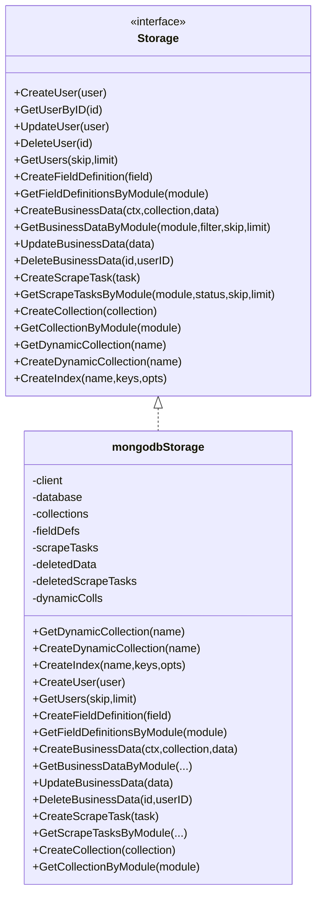
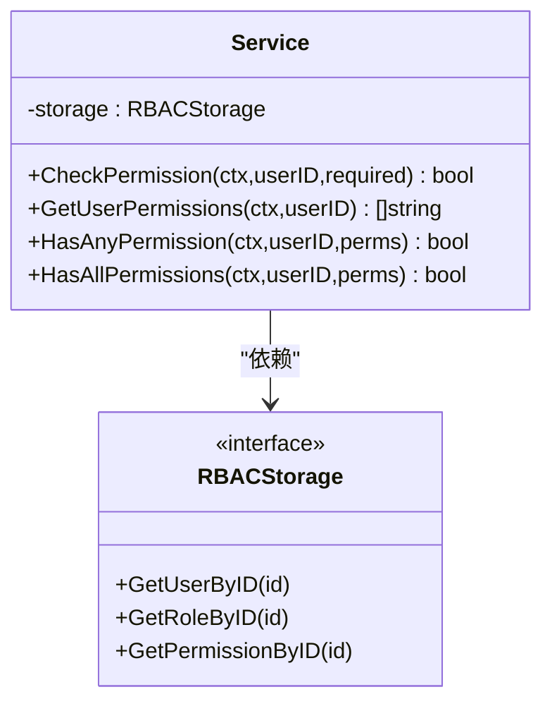
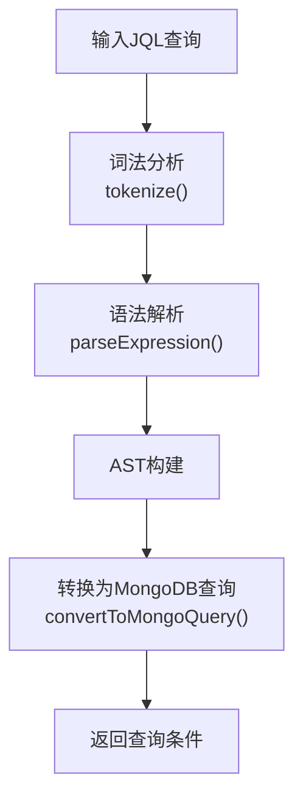
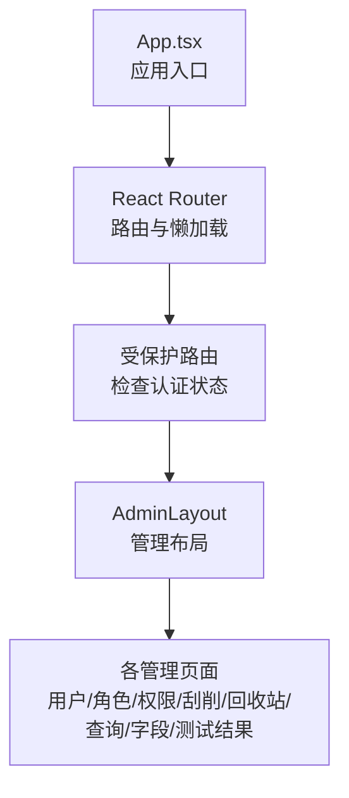
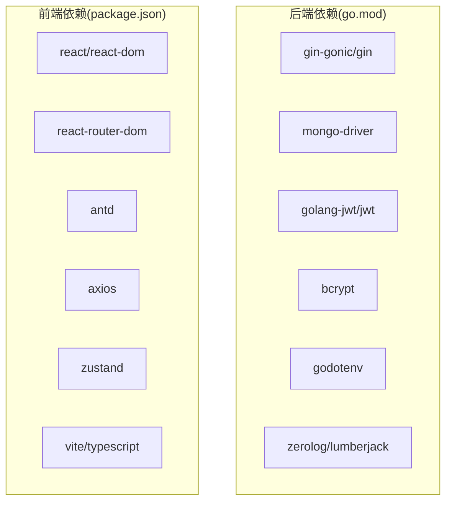

# 项目结构

<cite>
**本文引用的文件**
- [cmd/server/main.go](file://cmd/server/main.go)
- [internal/api/handlers.go](file://internal/api/handlers.go)
- [internal/storage/mongodb.go](file://internal/storage/mongodb.go)
- [internal/storage/mongodb_storage.go](file://internal/storage/mongodb_storage.go)
- [pkg/rbac/rbac.go](file://pkg/rbac/rbac.go)
- [pkg/jql/parser.go](file://pkg/jql/parser.go)
- [internal/models/models.go](file://internal/models/models.go)
- [internal/auth/jwt.go](file://internal/auth/jwt.go)
- [frontend/src/App.tsx](file://frontend/src/App.tsx)
- [frontend/src/services/api.ts](file://frontend/src/services/api.ts)
- [frontend/package.json](file://frontend/package.json)
- [go.mod](file://go.mod)
- [configs/config.yaml](file://configs/config.yaml)
- [README.md](file://README.md)
</cite>

## 目录
1. [简介](#简介)
2. [项目结构](#项目结构)
3. [核心组件](#核心组件)
4. [架构总览](#架构总览)
5. [详细组件分析](#详细组件分析)
6. [依赖关系分析](#依赖关系分析)
7. [性能考虑](#性能考虑)
8. [故障排除指南](#故障排除指南)
9. [结论](#结论)

## 简介
本项目是一个基于 Go 和 React 的数据中心管理系统，提供用户认证、RBAC 权限管理、业务数据管理与数据刮削功能。项目采用清晰的分层架构设计，后端通过 Gin 提供 REST API，前端使用 React + TypeScript 构建管理界面，数据持久化采用 MongoDB，权限控制基于 JWT 与 RBAC 服务，查询支持自研 JQL 语法。

## 项目结构
项目遵循“命令入口 + 内部包 + 公共包 + 前端应用”的组织方式，目录职责明确：
- cmd/server：后端主程序入口，负责环境初始化、服务装配与 HTTP 服务器启动
- internal：内部包，包含 API 处理器、认证、日志、模型、刮削、存储等核心业务模块
- pkg：公共包，提供跨模块复用能力（如 JQL 查询解析器、RBAC 权限服务）
- frontend：React 前端应用，包含页面、组件、服务、状态管理与主题配置
- configs：配置文件（示例 YAML）
- docs：项目文档（架构、RBAC、业务数据、日志、认证、查询等）

图表来源
- [cmd/server/main.go:1-167](file://cmd/server/main.go#L1-L167)
- [internal/api/handlers.go:1-1834](file://internal/api/handlers.go#L1-L1834)
- [internal/storage/mongodb.go:1-91](file://internal/storage/mongodb.go#L1-L91)
- [internal/storage/mongodb_storage.go:1-829](file://internal/storage/mongodb_storage.go#L1-L829)
- [pkg/rbac/rbac.go:1-250](file://pkg/rbac/rbac.go#L1-L250)
- [pkg/jql/parser.go:1-653](file://pkg/jql/parser.go#L1-L653)
- [internal/models/models.go:1-365](file://internal/models/models.go#L1-L365)
- [internal/auth/jwt.go:1-126](file://internal/auth/jwt.go#L1-L126)
- [frontend/src/App.tsx:1-69](file://frontend/src/App.tsx#L1-L69)
- [frontend/src/services/api.ts:1-37](file://frontend/src/services/api.ts#L1-L37)
- [frontend/package.json:1-29](file://frontend/package.json#L1-L29)

章节来源
- [README.md:22-41](file://README.md#L22-L41)
- [go.mod:1-50](file://go.mod#L1-L50)
- [configs/config.yaml:1-26](file://configs/config.yaml#L1-L26)

## 核心组件
- 后端入口（cmd/server/main.go）：加载环境变量、初始化日志、连接 MongoDB、启动刮削系统、创建 JWT/RBAC 服务、注册路由并启动 HTTP 服务器
- API 层（internal/api/handlers.go）：集中处理路由注册与各模块控制器方法，包含认证中间件、权限中间件、集合级权限中间件
- 存储层（internal/storage/*）：定义统一存储接口与 MongoDB 实现，支持用户、权限、角色、字段定义、业务数据、刮削任务、集合管理等 CRUD
- 权限服务（pkg/rbac/rbac.go）：提供权限检查、权限聚合、API 权限映射等能力
- 查询解析（pkg/jql/parser.go）：将 JQL 查询语句解析为 MongoDB 查询条件
- 数据模型（internal/models/models.go）：定义用户、权限、角色、业务数据、字段定义、刮削任务、集合等模型及校验逻辑
- 认证服务（internal/auth/jwt.go）：JWT 令牌签发、验证、刷新与密码加解密
- 前端应用（frontend/src/App.tsx）：基于 React Router 的受保护路由与页面布局
- 前端服务（frontend/src/services/api.ts）：Axios 客户端封装，自动注入令牌与统一错误处理

章节来源
- [cmd/server/main.go:24-150](file://cmd/server/main.go#L24-L150)
- [internal/api/handlers.go:45-181](file://internal/api/handlers.go#L45-L181)
- [internal/storage/mongodb.go:14-90](file://internal/storage/mongodb.go#L14-L90)
- [pkg/rbac/rbac.go:55-250](file://pkg/rbac/rbac.go#L55-L250)
- [pkg/jql/parser.go:37-653](file://pkg/jql/parser.go#L37-L653)
- [internal/models/models.go:12-365](file://internal/models/models.go#L12-L365)
- [internal/auth/jwt.go:20-126](file://internal/auth/jwt.go#L20-L126)
- [frontend/src/App.tsx:19-69](file://frontend/src/App.tsx#L19-L69)
- [frontend/src/services/api.ts:5-37](file://frontend/src/services/api.ts#L5-L37)

## 架构总览
系统采用四层架构：
- 表现层（前端 React）：负责用户交互与数据展示
- API 层（Gin）：接收请求、执行中间件、调用处理器
- 服务层（RBAC/JQL/认证）：提供权限判断、查询解析、令牌管理等业务能力
- 存储层（MongoDB）：持久化用户、权限、角色、业务数据、刮削任务等

图表来源
- [frontend/src/App.tsx:19-69](file://frontend/src/App.tsx#L19-L69)
- [internal/api/handlers.go:260-314](file://internal/api/handlers.go#L260-L314)
- [pkg/rbac/rbac.go:63-114](file://pkg/rbac/rbac.go#L63-L114)
- [pkg/jql/parser.go:46-65](file://pkg/jql/parser.go#L46-L65)
- [internal/storage/mongodb.go:14-90](file://internal/storage/mongodb.go#L14-L90)

## 详细组件分析

### 后端入口设计（cmd/server/main.go）
- 环境变量加载：优先加载项目根目录 .env，否则回退系统环境变量
- 日志初始化：支持级别、文件路径、轮转大小、备份数量、保留天数
- 存储初始化：分别初始化业务存储与 RBAC 存储，连接 MongoDB
- RBAC 初始化：初始化默认数据
- 刮削系统：创建并启动刮削系统，支持工作线程数配置
- 认证与权限：创建 JWT 服务与 RBAC 服务，初始化集合级 RBAC 存储与服务
- 路由注册：创建 Gin 路由器，添加 CORS、日志与恢复中间件，注册 API 路由
- 服务器启动：创建 HTTP 服务器，监听信号优雅关闭

图表来源
- [cmd/server/main.go:24-150](file://cmd/server/main.go#L24-L150)

章节来源
- [cmd/server/main.go:24-150](file://cmd/server/main.go#L24-L150)

### API 层（internal/api/handlers.go）
- 路由组织：按模块分组（用户、权限、角色、字段、业务数据、集合、刮削、回收站等），部分路由启用集合级权限中间件
- 中间件：
  - 认证中间件：校验 Authorization 头与 JWT 有效性，注入用户信息
  - 权限中间件：基于 RBAC 服务检查用户权限
  - 集合级权限中间件：针对集合级别的读写/删除等操作进行细粒度控制
- 控制器方法：实现登录、注册、用户 CRUD、角色/权限 CRUD、字段定义 CRUD、业务数据 CRUD、集合管理、刮削任务管理、回收站管理等

图表来源
- [internal/api/handlers.go:260-314](file://internal/api/handlers.go#L260-L314)
- [internal/api/handlers.go:45-181](file://internal/api/handlers.go#L45-L181)

章节来源
- [internal/api/handlers.go:45-181](file://internal/api/handlers.go#L45-L181)
- [internal/api/handlers.go:183-258](file://internal/api/handlers.go#L183-L258)

### 存储层（internal/storage/*）
- 接口定义（Storage）：统一抽象用户、权限、角色、字段定义、业务数据、刮削任务、集合管理等 CRUD 操作
- MongoDB 实现：连接数据库、管理动态集合、索引创建、分页查询、软删除与恢复、计数统计等
- 关键能力：
  - 动态集合：根据模块名拼接集合名，支持按需创建与缓存
  - 软删除：业务数据与刮削任务删除时写入删除集合，支持恢复
  - 分页与排序：统一使用 skip/limit 或 page/pageSize 参数
  - 索引管理：支持为动态集合创建索引

图表来源
- [internal/storage/mongodb.go:14-90](file://internal/storage/mongodb.go#L14-L90)
- [internal/storage/mongodb_storage.go:16-829](file://internal/storage/mongodb_storage.go#L16-L829)

章节来源
- [internal/storage/mongodb.go:14-90](file://internal/storage/mongodb.go#L14-L90)
- [internal/storage/mongodb_storage.go:27-829](file://internal/storage/mongodb_storage.go#L27-L829)

### 权限服务（pkg/rbac/rbac.go）
- 权限常量：定义用户、角色、权限、集合、字段、数据、刮削等细粒度权限
- RBAC 服务：检查用户权限、聚合用户权限、API 权限映射（根据 HTTP 方法与路径推导所需权限）、支持通配符匹配
- 特性：超级管理员权限可绕过限制；支持任意/全部权限判断

图表来源
- [pkg/rbac/rbac.go:55-250](file://pkg/rbac/rbac.go#L55-L250)

章节来源
- [pkg/rbac/rbac.go:55-250](file://pkg/rbac/rbac.go#L55-L250)

### 查询解析（pkg/jql/parser.go）
- 词法分析：识别字段、操作符、函数、括号、逻辑运算符、IN/NOT IN、IS NULL/IS NOT NULL 等
- 语法解析：构建 AST（$and/$or/$not/$regex/$in/$nin 等），支持括号分组
- 转换：将 AST 转换为 MongoDB 查询条件
- 示例：支持多种组合查询与时间函数（如 StartOfWeek、EndOfMonth）

图表来源
- [pkg/jql/parser.go:46-653](file://pkg/jql/parser.go#L46-L653)

章节来源
- [pkg/jql/parser.go:46-653](file://pkg/jql/parser.go#L46-L653)

### 数据模型（internal/models/models.go）
- 基础模型：包含创建者、创建时间、更新者、更新时间
- 字段定义：模块、字段名、类型、约束（最小/最大、最小/最大长度、正则、枚举、列表长度等）
- 业务数据：模块标识、描述、自定义字段、文件路径
- 删除记录：软删除时保存原始数据与删除时间
- 用户/权限/角色：用户基本信息、角色与权限关联
- 刮削任务：模块、数据路径、刮削路径、状态、结果、错误信息、时间戳
- 集合与集合角色：模块、集合名、角色类型与权限集合
- 校验：字段定义支持多类型校验与错误收集

章节来源
- [internal/models/models.go:12-365](file://internal/models/models.go#L12-L365)

### 认证服务（internal/auth/jwt.go）
- JWT 结构：包含用户ID、角色、权限、标准声明
- 服务接口：生成、验证、刷新令牌
- 密码处理：bcrypt 加密与校验
- 令牌刷新：支持过期令牌在刷新窗口内刷新

章节来源
- [internal/auth/jwt.go:12-126](file://internal/auth/jwt.go#L12-L126)

### 前端架构（frontend/src/App.tsx）
- 路由：基于 React Router v6，支持懒加载与受保护路由
- 布局：AdminLayout 包裹多个管理页面（用户、角色、权限、刮削中心、回收站、查询、字段、测试结果等）
- 认证：受保护路由在渲染前检查本地令牌，未登录跳转登录页
- 主题：Ant Design 主题配置

图表来源
- [frontend/src/App.tsx:19-69](file://frontend/src/App.tsx#L19-L69)

章节来源
- [frontend/src/App.tsx:19-69](file://frontend/src/App.tsx#L19-L69)

### 前端服务（frontend/src/services/api.ts）
- Axios 客户端：设置基础 URL、超时
- 请求拦截：自动附加 Bearer 令牌
- 响应拦截：401 自动登出并跳转登录页

章节来源
- [frontend/src/services/api.ts:5-37](file://frontend/src/services/api.ts#L5-L37)

## 依赖关系分析
- 后端依赖：Gin（Web 框架）、MongoDB Driver（数据库）、JWT（令牌）、bcrypt（密码）、godotenv（环境变量）、zerolog/lumberjack（日志）
- 前端依赖：React、React Router、Ant Design、Axios、Zustand（状态管理）、Vite（构建）

图表来源
- [go.mod:5-14](file://go.mod#L5-L14)
- [frontend/package.json:12-28](file://frontend/package.json#L12-L28)

章节来源
- [go.mod:1-50](file://go.mod#L1-L50)
- [frontend/package.json:1-29](file://frontend/package.json#L1-L29)

## 性能考虑
- 并发与异步：后端通过工作池并发处理刮削任务，避免阻塞主线程
- 分页与索引：存储层支持 skip/limit 分页与动态集合索引创建，提升查询性能
- 缓存：动态集合句柄缓存减少重复获取集合对象的开销
- 中间件：Gin 恢复中间件保障异常不中断服务
- 前端懒加载：React 懒加载与 Suspense 减少首屏体积与提升交互体验

## 故障排除指南
- 后端启动失败：检查 .env 配置（MONGODB_URI、JWT_SECRET、端口等），确认 MongoDB 可连通
- 认证失败：确认 Authorization 头格式为 Bearer 令牌，检查 JWT 密钥与过期时间
- 权限不足：确认用户角色与权限分配，检查 API 权限映射规则
- 查询异常：使用 JQL 示例进行对比，确保语法正确（括号、大小写、函数）
- 前端 401：确认本地存储 token 是否存在，检查后端 CORS 配置

章节来源
- [cmd/server/main.go:24-150](file://cmd/server/main.go#L24-L150)
- [internal/api/handlers.go:260-314](file://internal/api/handlers.go#L260-L314)
- [pkg/jql/parser.go:625-653](file://pkg/jql/parser.go#L625-L653)
- [frontend/src/services/api.ts:23-35](file://frontend/src/services/api.ts#L23-L35)

## 结论
该项目通过清晰的目录划分与分层架构，实现了认证、权限、数据管理与刮削的完整闭环。后端以 Gin 为核心，结合 RBAC 与 JQL 提供灵活的权限控制与查询能力；前端以 React 为基础，配合 Ant Design 与状态管理提供良好的用户体验。整体结构便于扩展与维护，适合在企业级数据中心场景中部署与演进。