# 数据中心系统架构设计文档

## 文档版本信息

| 版本 | 日期 | 说明 |
|------|------|------|
| 1.0 | 2024-01-15 | 初始版本 |
| 2.0 | 2026-04-19 | 重大更新：新增数据导出功能、完整的Mermaid图表 |

---

## 目录

1. [系统概述](#1-系统概述)
2. [系统架构](#2-系统架构)
3. [技术栈](#3-技术栈)
4. [模块划分](#4-模块划分)
5. [数据库架构](#5-数据库架构)
6. [数据模型](#6-数据模型)
7. [API架构](#7-api架构)
8. [核心业务流程](#8-核心业务流程)
9. [RBAC权限模型](#9-rbac权限模型)
10. [导出功能设计](#10-导出功能设计)

---

## 1. 系统概述

### 1.1 项目简介

数据中心系统是一个基于Go和React的企业级数据管理平台，提供用户认证、RBAC权限管理、业务数据管理和数据刮削功能。系统采用微服务化的分层架构设计，支持多模块数据管理、软删除、数据恢复等企业级特性。

### 1.2 核心特性

- **多模块数据管理**：支持图书、电影、音乐、游戏等多种数据模块
- **RBAC权限控制**：基于角色的访问控制，支持细粒度权限管理
- **数据刮削系统**：异步并发处理数据刮削任务，支持任务状态管理和重试
- **软删除与恢复**：支持数据软删除和恢复，防止误删
- **JQL查询**：自定义查询语言，支持灵活的数据检索
- **数据导出**：支持多格式数据导出（JSON、CSV、Excel等）
- **双数据库架构**：业务数据和RBAC数据分离存储，提高安全性

---

## 2. 系统架构

### 2.1 整体架构图

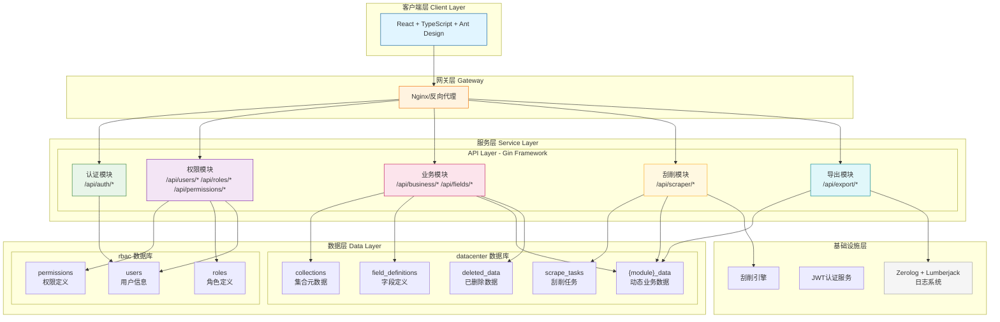

### 2.2 请求处理流程

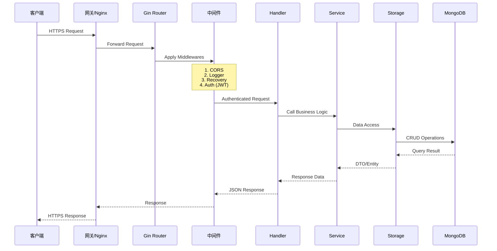

### 2.3 系统部署架构

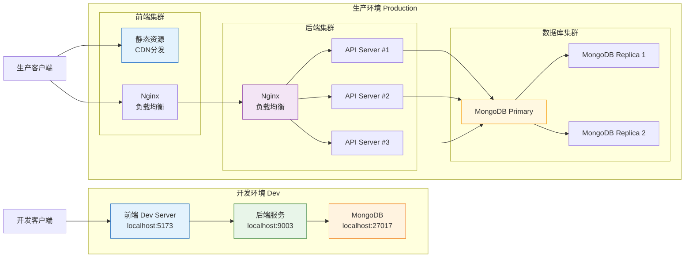

---

## 3. 技术栈

### 3.1 技术栈总览

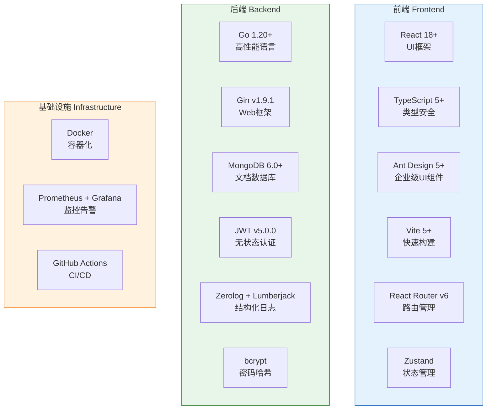

### 3.2 技术选型说明

| 分类 | 技术 | 版本 | 说明 |
|------|------|------|------|
| **后端** | | | |
| 语言 | Go | 1.20+ | 编译型语言，高性能，适合高并发 |
| 框架 | Gin | v1.9.1 | 轻量级Web框架，性能出色 |
| 数据库 | MongoDB | 6.0+ | 文档型数据库，支持动态字段 |
| 认证 | JWT | v5.0.0 | 无状态认证 |
| 日志 | zerolog + lumberjack | - | 高性能结构化日志 |
| 密码 | bcrypt | v0.14.0 | 安全密码哈希 |
| **前端** | | | |
| 框架 | React | 18+ | UI框架 |
| 语言 | TypeScript | 5+ | 类型安全 |
| UI库 | Ant Design | 5+ | 企业级UI组件 |
| 构建 | Vite | 5+ | 快速构建工具 |
| 路由 | React Router | v6 | 路由管理 |
| 状态 | Zustand | - | 轻量状态管理 |

---

## 4. 模块划分

### 4.1 项目目录结构

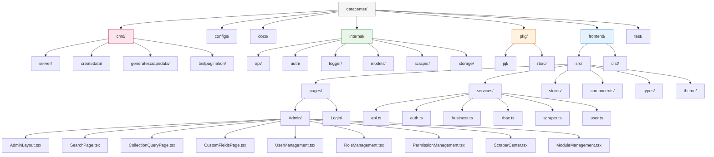

### 4.2 模块职责矩阵

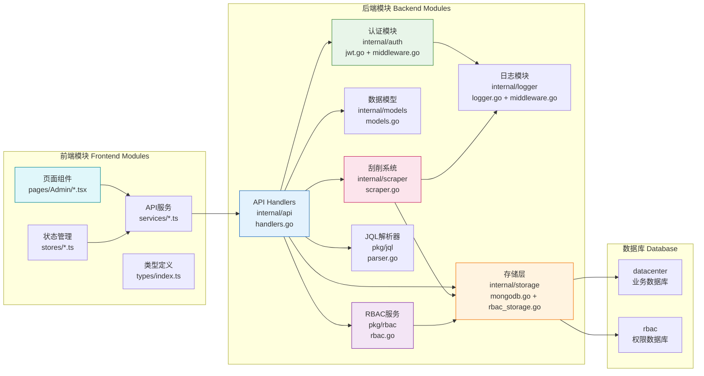

### 4.3 模块依赖关系

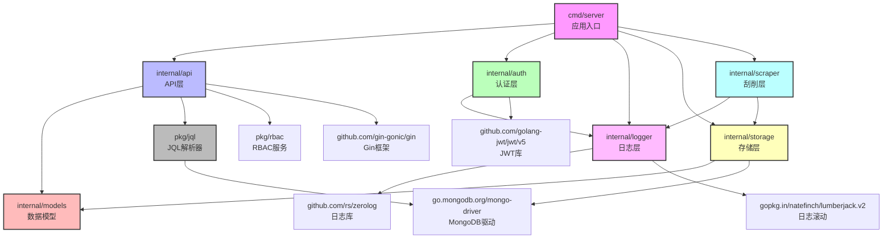

---

## 5. 数据库架构

### 5.1 双数据库设计

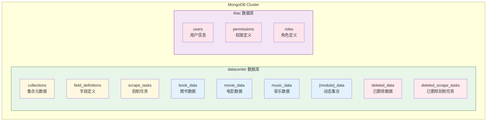

### 5.2 集合关联图

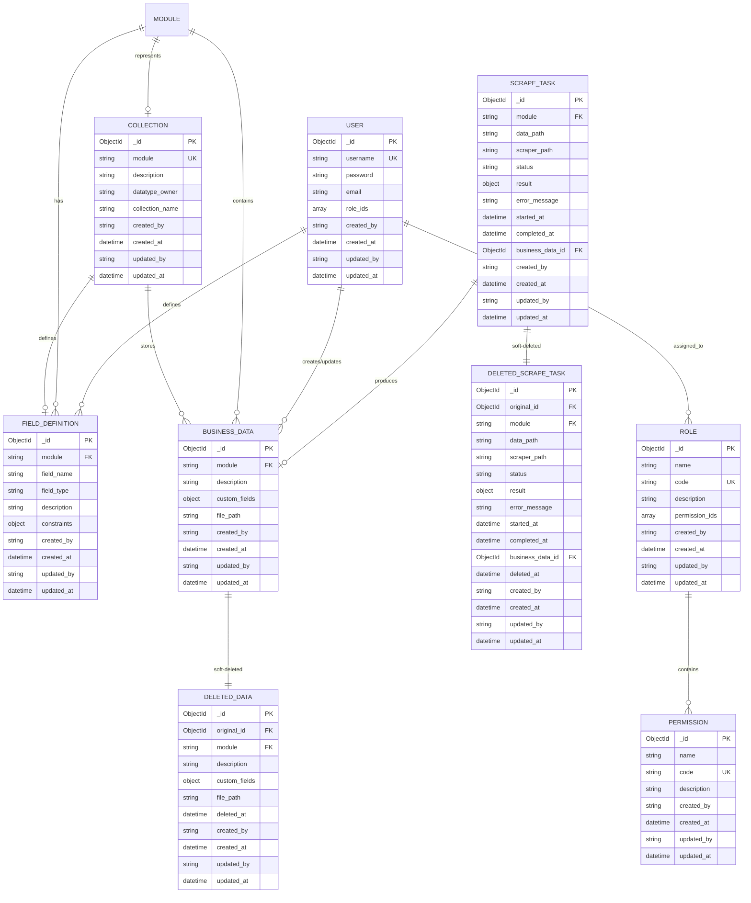

---

## 6. 数据模型

### 6.1 实体关系详细图

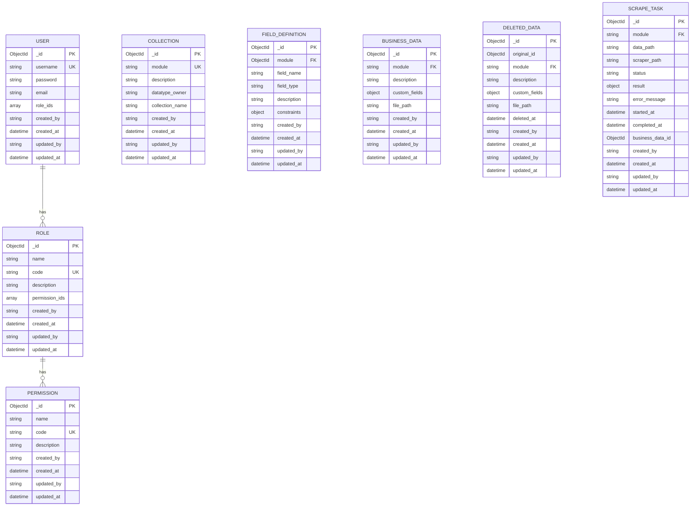

### 6.2 数据模型JSON Schema

#### 6.2.1 用户模型 (User)

```json
{
  "_id": "ObjectId",
  "username": "admin",
  "password": "$2a$10$X/...",
  "email": "admin@datacenter.local",
  "role_ids": ["role_id_1", "role_id_2"],
  "created_by": "system",
  "created_at": "2024-01-01T00:00:00Z",
  "updated_by": "system",
  "updated_at": "2024-01-01T00:00:00Z"
}
```

| 字段 | 类型 | 说明 |
|------|------|------|
| _id | ObjectId | 用户唯一标识 |
| username | string | 用户名，唯一索引 |
| password | string | bcrypt加密密码 |
| email | string | 邮箱地址 |
| role_ids | array | 所属角色ID列表 |
| created_by | string | 创建者 |
| created_at | datetime | 创建时间 |
| updated_by | string | 更新者 |
| updated_at | datetime | 更新时间 |

#### 6.2.2 角色模型 (Role)

```json
{
  "_id": "ObjectId",
  "name": "管理员",
  "code": "admin",
  "description": "系统管理员，拥有所有权限",
  "permission_ids": ["perm_id_1", "perm_id_2", "..."],
  "created_by": "system",
  "created_at": "2024-01-01T00:00:00Z",
  "updated_by": "system",
  "updated_at": "2024-01-01T00:00:00Z"
}
```

| 字段 | 类型 | 说明 |
|------|------|------|
| _id | ObjectId | 角色唯一标识 |
| name | string | 角色名称 |
| code | string | 角色代码，唯一索引 |
| description | string | 角色描述 |
| permission_ids | array | 权限ID列表 |
| created_by | string | 创建者 |
| created_at | datetime | 创建时间 |
| updated_by | string | 更新者 |
| updated_at | datetime | 更新时间 |

#### 6.2.3 权限模型 (Permission)

```json
{
  "_id": "ObjectId",
  "name": "用户管理",
  "code": "user:manage",
  "description": "管理系统用户账户",
  "created_by": "system",
  "created_at": "2024-01-01T00:00:00Z",
  "updated_by": "system",
  "updated_at": "2024-01-01T00:00:00Z"
}
```

| 字段 | 类型 | 说明 |
|------|------|------|
| _id | ObjectId | 权限唯一标识 |
| name | string | 权限名称 |
| code | string | 权限代码，唯一索引 |
| description | string | 权限描述 |
| created_by | string | 创建者 |
| created_at | datetime | 创建时间 |
| updated_by | string | 更新者 |
| updated_at | datetime | 更新时间 |

#### 6.2.4 业务数据模型 (BusinessData)

```json
{
  "_id": "ObjectId",
  "module": "movie",
  "description": "Harry Potter 电影数据",
  "custom_fields": {
    "title": "Harry Potter and the Sorcerer's Stone",
    "director": "Chris Columbus",
    "year": 2001,
    "genre": ["Fantasy", "Adventure"],
    "rating": 7.6,
    "scrape_path": "/scrapers/movie_scraper.py",
    "data_path": "/data/movies/harry_potter.json",
    "task_id": "ObjectId",
    "scraped_at": "2024-01-15T10:30:02Z"
  },
  "file_path": "/data/movies/harry_potter.json",
  "created_by": "admin",
  "created_at": "2024-01-15T10:30:02Z",
  "updated_by": "admin",
  "updated_at": "2024-01-15T10:30:02Z"
}
```

| 字段 | 类型 | 说明 |
|------|------|------|
| _id | ObjectId | 数据唯一标识 |
| module | string | 所属模块 |
| description | string | 数据描述 |
| custom_fields | object | 自定义字段集合 |
| file_path | string | 原始数据文件路径 |
| created_by | string | 创建者 |
| created_at | datetime | 创建时间 |
| updated_by | string | 更新者 |
| updated_at | datetime | 更新时间 |

#### 6.2.5 字段定义模型 (FieldDefinition)

```json
{
  "_id": "ObjectId",
  "module": "movie",
  "field_name": "title",
  "field_type": "string",
  "description": "电影标题",
  "constraints": {
    "min_length": 1,
    "max_length": 200
  },
  "created_by": "admin",
  "created_at": "2024-01-15T10:00:00Z",
  "updated_by": "admin",
  "updated_at": "2024-01-15T10:00:00Z"
}
```

| 字段 | 类型 | 说明 |
|------|------|------|
| _id | ObjectId | 字段定义唯一标识 |
| module | string | 所属模块 |
| field_name | string | 字段名称 |
| field_type | enum | 字段类型: int/float/string/list |
| description | string | 字段描述 |
| constraints | object | 字段约束 |
| created_by | string | 创建者 |
| created_at | datetime | 创建时间 |
| updated_by | string | 更新者 |
| updated_at | datetime | 更新时间 |

#### 6.2.6 刮削任务模型 (ScrapeTask)

```json
{
  "_id": "ObjectId",
  "module": "movie",
  "data_path": "/data/movies/harry_potter.json",
  "scraper_path": "/scrapers/movie_scraper.py",
  "status": "success",
  "result": {
    "items_scraped": 8,
    "duration_ms": 1523
  },
  "error_message": "",
  "started_at": "2024-01-15T10:30:00Z",
  "completed_at": "2024-01-15T10:30:02Z",
  "business_data_id": "ObjectId",
  "created_by": "admin",
  "created_at": "2024-01-15T10:30:00Z",
  "updated_by": "admin",
  "updated_at": "2024-01-15T10:30:02Z"
}
```

| 字段 | 类型 | 说明 |
|------|------|------|
| _id | ObjectId | 任务唯一标识 |
| module | string | 所属模块 |
| data_path | string | 原始数据文件路径 |
| scraper_path | string | 刮削器脚本路径 |
| status | enum | 任务状态: pending/scraping/success/failed |
| result | object | 刮削结果详情 |
| error_message | string | 失败时的错误信息 |
| started_at | datetime | 开始时间 |
| completed_at | datetime | 完成时间 |
| business_data_id | ObjectId | 关联的业务数据ID |
| created_by | string | 创建者 |
| created_at | datetime | 创建时间 |
| updated_by | string | 更新者 |
| updated_at | datetime | 更新时间 |

---

## 7. API架构

### 7.1 API路由总览

```mermaid
graph TD
    API["/api"] --> AUTH["/auth"]
    API --> USERS["/users"]
    API --> PERMS["/permissions"]
    API --> ROLES["/roles"]
    API --> FIELDS["/fields"]
    API --> BIZ["/business"]
    API --> DELETED["/deleted"]
    API --> SCRAPER["/scraper"]
    API --> COLLECTIONS["/collections"]
    API --> EXPORT["/export"]

    AUTH --> AUTH_LOGIN["POST /login"]
    AUTH --> AUTH_REGISTER["POST /register"]

    USERS --> USERS_CRUD["CRUD /:id"]
    USERS --> USERS_ROLES["POST/DELETE /:id/roles"]
    USERS --> USERS_GET_ROLES["GET /:id/roles"]

    PERMS --> PERMS_CRUD["CRUD /:id"]

    ROLES --> ROLES_CRUD["CRUD /:id"]
    ROLES --> ROLES_PERMS["POST/DELETE /:id/permissions"]
    ROLES --> ROLES_GET_PERMS["GET /:id/permissions"]

    FIELDS --> FIELDS_BY_MODULE["GET /module/:module"]
    FIELDS --> FIELDS_CRUD["CRUD /:id"]

    BIZ --> BIZ_CREATE["POST /"]
    BIZ --> BIZ_BY_MODULE["GET /module/:module"]
    BIZ --> BIZ_BY_ID["CRUD /module/:module/:id"]

    DELETED --> DELETED_BY_MODULE["GET /module/:module"]
    DELETED --> DELETED_BY_ID["GET /:id"]
    DELETED --> DELETED_RECOVER["POST /:id/recover"]

    SCRAPER --> SCRAPER_UPLOAD["POST /upload"]
    SCRAPER --> SCRAPER_TASKS["CRUD /tasks/:id"]
    SCRAPER --> SCRAPER_RETRY["POST /tasks/:id/retry"]

    COLLECTIONS --> COLLECTIONS_CRUD["CRUD /:module"]
    COLLECTIONS --> COLLECTIONS_INDEXES["POST/GET/DELETE /:module/indexes"]

    EXPORT --> EXPORT_DATA["POST /data"]
    EXPORT --> EXPORT_STATUS["GET /status/:id"]

    style API fill:#e3f2fd,stroke:#1565c0
    style AUTH fill:#e8f5e9,stroke:#2e7d32
    style USERS fill:#f3e5f5,stroke:#7b1fa2
    style BIZ fill:#fce4ec,stroke:#c2185b
    style SCRAPER fill:#fff8e1,stroke:#f9a825
    style EXPORT fill:#e0f7fa,stroke:#00838f
```

### 7.2 API分组详情

| 分组 | 路径前缀 | 说明 | 认证 |
|------|----------|------|------|
| 认证 | /api/auth | 用户登录注册 | 否 |
| 用户 | /api/users | 用户CRUD和角色分配 | 是 |
| 权限 | /api/permissions | 权限CRUD | 是 |
| 角色 | /api/roles | 角色CRUD和权限分配 | 是 |
| 字段 | /api/fields | 自定义字段CRUD | 是 |
| 业务 | /api/business | 业务数据CRUD | 是 |
| 删除 | /api/deleted | 已删除数据查询和恢复 | 是 |
| 刮削 | /api/scraper | 刮削任务管理 | 是 |
| 集合 | /api/collections | 集合元数据管理 | 是 |
| 导出 | /api/export | 数据导出功能 | 是 |

### 7.3 API端点详细清单

#### 7.3.1 认证接口

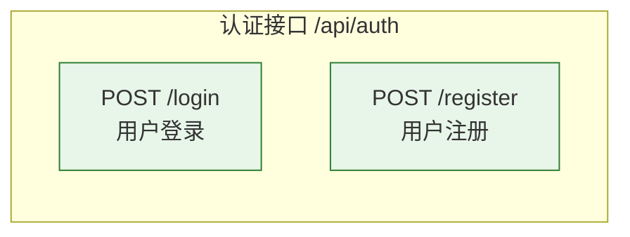

| 方法 | 路径 | 说明 | 认证 |
|------|------|------|------|
| POST | /api/auth/login | 用户登录 | 否 |
| POST | /api/auth/register | 用户注册 | 否 |

#### 7.3.2 用户管理接口

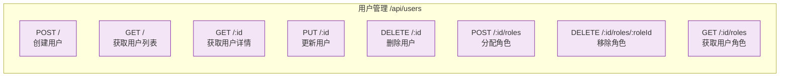

| 方法 | 路径 | 说明 |
|------|------|------|
| POST | /api/users | 创建用户 |
| GET | /api/users | 获取用户列表 (分页) |
| GET | /api/users/:id | 获取用户详情 |
| PUT | /api/users/:id | 更新用户 |
| DELETE | /api/users/:id | 删除用户 |
| POST | /api/users/:id/roles | 分配角色 |
| DELETE | /api/users/:id/roles/:roleId | 移除角色 |
| GET | /api/users/:id/roles | 获取用户角色 |

#### 7.3.3 业务数据接口

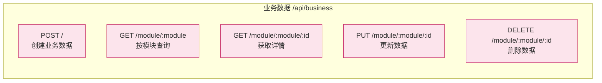

| 方法 | 路径 | 说明 |
|------|------|------|
| POST | /api/business | 创建业务数据(触发刮削) |
| GET | /api/business/module/:module | 按模块查询 (分页) |
| GET | /api/business/module/:module/:id | 获取详情 |
| PUT | /api/business/module/:module/:id | 更新 |
| DELETE | /api/business/module/:module/:id | 删除(软删除) |

#### 7.3.4 数据导出接口

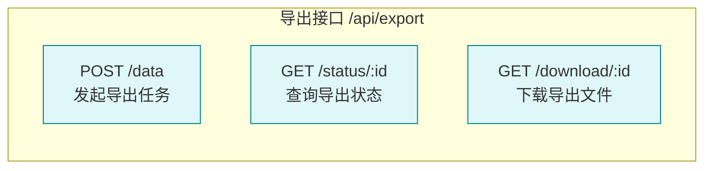

| 方法 | 路径 | 说明 |
|------|------|------|
| POST | /api/export/data | 发起数据导出任务 |
| GET | /api/export/status/:id | 查询导出状态 |
| GET | /api/export/download/:id | 下载导出文件 |

---

## 8. 核心业务流程

### 8.1 用户认证流程

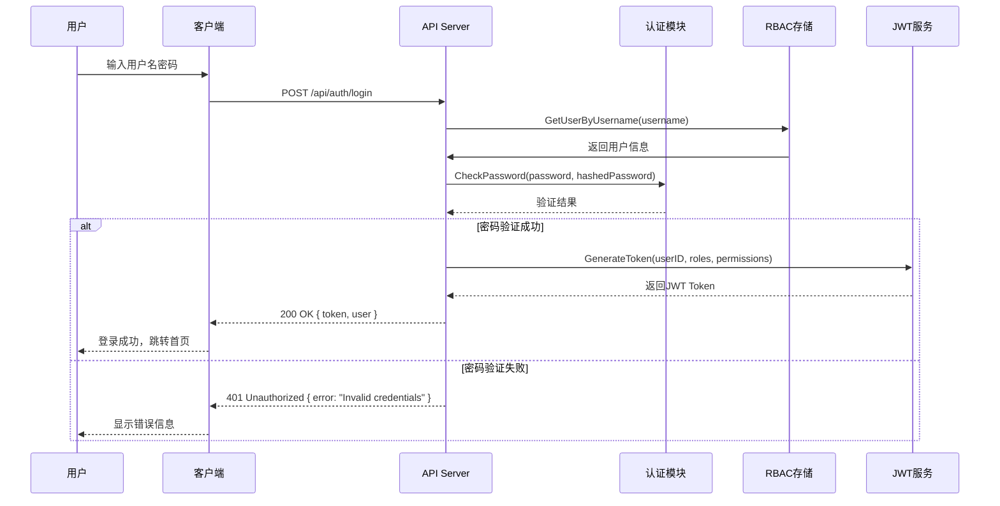

### 8.2 数据刮削流程

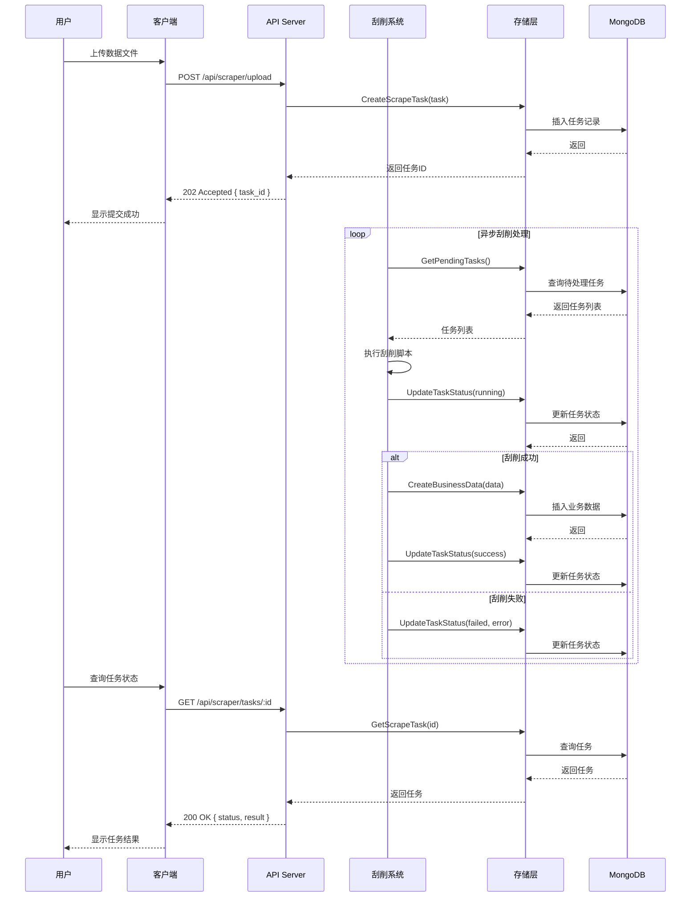

### 8.3 数据导出流程

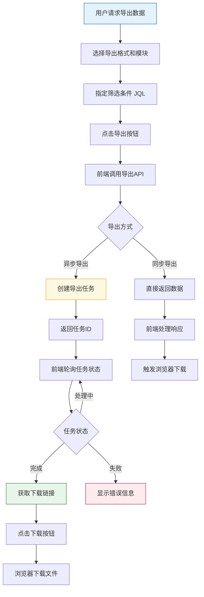

### 8.4 数据软删除与恢复流程

```mermaid
flowchart TD
    subgraph 删除流程["数据删除流程"]
        A1[删除请求] --> A2[验证用户权限]
        A2 --> A3{权限检查}
        A3 -->|无权限| A4[返回403 Forbidden]
        A3 -->|有权限| A5[获取原始数据]
        A5 --> A6[创建删除记录]
        A6 --> A7[插入deleted_data集合]
        A7 --> A8[删除原始数据]
        A8 --> A9[返回成功响应]
    end

    subgraph 恢复流程["数据恢复流程"]
        B1[恢复请求] --> B2[验证用户权限]
        B2 --> B3{权限检查}
        B3 -->|无权限| B4[返回403 Forbidden]
        B3 -->|有权限| B5[获取删除记录]
        B5 --> B6[创建新业务数据]
        B6 --> B7[插入业务集合]
        B7 --> B8[删除删除记录]
        B8 --> B9[返回成功响应]
    end

    subgraph 清理流程["定时清理流程"]
        C1[定时任务触发] --> C2[查询48小时前的删除记录]
        C2 --> C3[批量删除过期记录]
        C3 --> C4[清理完成]
    end

    style A1 fill:#ffebee,stroke:#c2185b
    style B1 fill:#e8f5e9,stroke:#2e7d32
    style C1 fill:#fff3e0,stroke:#ef6c00
```

### 8.5 JQL查询处理流程

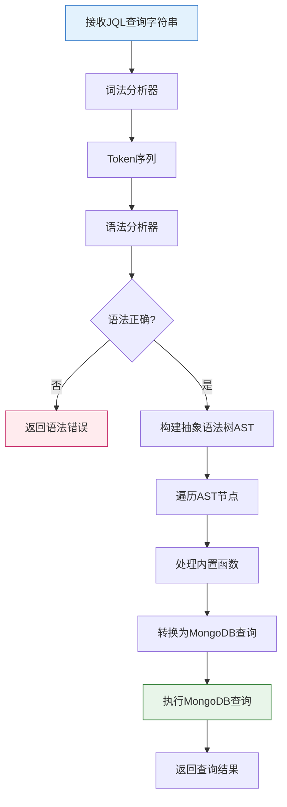

---

## 9. RBAC权限模型

### 9.1 RBAC模型结构

```mermaid
graph TB
    subgraph 核心实体["RBAC核心实体"]
        USER["用户<br/>User"]
        ROLE["角色<br/>Role"]
        PERMISSION["权限<br/>Permission"]
    end

    subgraph 关系["关系"]
        UR["用户-角色关系<br/>User-Role"]
        RP["角色-权限关系<br/>Role-Permission"]
    end

    USER --> UR
    ROLE --> UR
    ROLE --> RP
    PERMISSION --> RP

    USER -->|1:N| USER1["用户1<br/>用户2<br/>用户3..."]
    ROLE -->|1:N| ROLE1["角色1<br/>角色2<br/>角色3..."]
    PERMISSION -->|1:N| PERM1["权限1<br/>权限2<br/>权限3..."]

    style USER fill:#e3f2fd,stroke:#1565c0
    style ROLE fill:#f3e5f5,stroke:#7b1fa2
    style PERMISSION fill:#e8f5e9,stroke:#2e7d32
    style UR fill:#fff8e1,stroke:#f9a825
    style RP fill:#fff8e1,stroke:#f9a825
```

### 9.2 内置权限清单

```mermaid
graph TB
    subgraph 系统权限["系统权限 System Permissions"]
        P1["user:manage<br/>用户管理"]
        P2["role:manage<br/>角色管理"]
        P3["permission:manage<br/>权限管理"]
    end

    subgraph 数据权限["数据权限 Data Permissions"]
        P4["data:query<br/>数据查询"]
        P5["data:create<br/>数据创建"]
        P6["data:update<br/>数据更新"]
        P7["data:delete<br/>数据删除"]
    end

    subgraph 业务权限["业务权限 Business Permissions"]
        P8["datatype:define<br/>类型定义"]
        P9["collection:manage<br/>集合管理"]
        P10["scrape:manage<br/>刮削管理"]
        P11["audit:view<br/>审计查看"]
    end

    style P1 fill:#ffebee,stroke:#c2185b
    style P2 fill:#ffebee,stroke:#c2185b
    style P3 fill:#ffebee,stroke:#c2185b
    style P4 fill:#e8f5e9,stroke:#2e7d32
    style P5 fill:#e8f5e9,stroke:#2e7d32
    style P6 fill:#e8f5e9,stroke:#2e7d32
    style P7 fill:#e8f5e9,stroke:#2e7d32
    style P8 fill:#e3f2fd,stroke:#1565c0
    style P9 fill:#e3f2fd,stroke:#1565c0
    style P10 fill:#e3f2fd,stroke:#1565c0
    style P11 fill:#e3f2fd,stroke:#1565c0
```

### 9.3 内置角色定义

```mermaid
graph TB
    subgraph 角色["内置角色"]
        R1["root<br/>超级管理员<br/>全部11个权限"]
        R2["datatypeowner<br/>数据类型所有者<br/>data:* + datatype:*<br/>+ collection:* + scrape:*"]
        R3["dataowner<br/>数据所有者<br/>data:*"]
        R4["admin<br/>集合管理员<br/>data:*"]
        R5["user<br/>集合用户<br/>data:query + data:update"]
        R6["viewer<br/>只读用户<br/>data:query"]
    end

    style R1 fill:#fce4ec,stroke:#c2185b
    style R2 fill:#f3e5f5,stroke:#7b1fa2
    style R3 fill:#e8f5e9,stroke:#2e7d32
    style R4 fill:#fff8e1,stroke:#f9a825
    style R5 fill:#e3f2fd,stroke:#1565c0
    style R6 fill:#f5f5f5,stroke:#9e9e9e
```

### 9.4 权限检查流程

```mermaid
sequenceDiagram
    participant C as 客户端
    participant API as API Server
    participant Auth as 认证中间件
    participant RBAC as RBAC服务
    participant Store as RBAC存储

    C->>API: 请求API (携带JWT)
    API->>Auth: 验证JWT Token
    Auth-->>API: Token有效，返回用户信息
    API->>RBAC: CheckPermission(userID, requiredPermission)
    RBAC->>Store: GetUserRoles(userID)
    Store-->>RBAC: 返回用户角色列表
    loop 遍历每个角色
        RBAC->>Store: GetRolePermissions(roleID)
        Store-->>RBAC: 返回角色权限列表
    end
    RBAC-->>API: 返回权限检查结果

    alt 有权限
        API->>API: 处理业务逻辑
        API-->>C: 200 OK
    else 无权限
        API-->>C: 403 Forbidden
    end
```

---

## 10. 导出功能设计

### 10.1 导出功能架构

```mermaid
graph TB
    subgraph 导出请求["导出请求层"]
        FE["前端应用"]
        API["导出API"]
    end

    subgraph 导出服务["导出服务层"]
        EM["导出管理器"]
        EF["导出格式化器"]
        WG["Worker Pool<br/>工作池"]
    end

    subgraph 导出器["导出格式化器"]
        JSON["JSON导出器"]
        CSV["CSV导出器"]
        EXCEL["Excel导出器"]
    end

    subgraph 存储["临时存储"]
        FS["文件系统<br/>/export/temp/"]
        REDIS["Redis<br/>任务状态缓存"]
    end

    FE --> API
    API --> EM
    EM --> EF
    EM --> WG
    EF --> JSON
    EF --> CSV
    EF --> EXCEL
    JSON --> FS
    CSV --> FS
    EXCEL --> FS
    EM --> REDIS

    style FE fill:#e3f2fd,stroke:#1565c0
    style API fill:#e8f5e9,stroke:#2e7d32
    style EM fill:#fff8e1,stroke:#f9a825
    style JSON fill:#fce4ec,stroke:#c2185b
    style CSV fill:#fce4ec,stroke:#c2185b
    style EXCEL fill:#fce4ec,stroke:#c2185b
    style FS fill:#f5f5f5,stroke:#9e9e9e
```

### 10.2 导出流程时序图

```mermaid
sequenceDiagram
    participant U as 用户
    participant FE as 前端
    participant API as 导出API
    participant EM as 导出管理器
    participant WF as WorkerPool
    participant EF as 格式化器
    participant FS as 文件系统
    participant DB as MongoDB

    U->>FE: 选择导出选项
    FE->>FE: 选择模块、格式、筛选条件
    FE->>API: POST /api/export/data
    API->>EM: CreateExportTask(params)
    EM->>DB: 查询源数据
    DB-->>EM: 返回数据
    EM-->>API: 返回任务ID
    API-->>FE: 202 Accepted { task_id }
    FE-->>U: 显示导出中

    loop 异步处理
        EM->>WF: SubmitJob(task)
        WF->>EF: FormatData(data, format)
        EF-->>WF: FormattedData
        WF->>FS: SaveFile(data)
        FS-->>WF: FilePath
        WF->>EM: JobComplete(path)
        EM->>DB: 更新任务状态
    end

    U->>FE: 查询导出状态
    FE->>API: GET /api/export/status/:id
    API->>DB: GetTaskStatus
    DB-->>API: status: completed
    API-->>FE: 200 OK { status, download_url }
    FE-->>U: 显示下载按钮

    U->>FE: 点击下载
    FE->>API: GET /api/export/download/:id
    API->>FS: GetFile
    FS-->>API: File
    API-->>FE: File Stream
    FE->>FE: 触发浏览器下载
```

### 10.3 支持的导出格式

```mermaid
graph LR
    subgraph 导出格式["支持的导出格式"]
        JSON["JSON<br/>application/json<br/>结构化数据交换"]
        CSV["CSV<br/>text/csv<br/>表格数据"]
        EXCEL["Excel<br/>application/vnd.openxmlformats<br/>电子表格"]
    end

    subgraph 特性["格式特性"]
        F1["JSON: 嵌套结构<br/>完整数据类型<br/>易于程序处理"]
        F2["CSV: 扁平结构<br/>通用兼容<br/>适合数据分析"]
        F3["Excel: 多Sheet支持<br/>格式保留<br/>适合报表"]
    end

    JSON --> F1
    CSV --> F2
    EXCEL --> F3

    style JSON fill:#fce4ec,stroke:#c2185b
    style CSV fill:#e8f5e9,stroke:#2e7d32
    style EXCEL fill:#e3f2fd,stroke:#1565c0
```

### 10.4 导出API请求响应示例

#### 10.4.1 创建导出任务

**请求:**
```http
POST /api/export/data
Content-Type: application/json
Authorization: Bearer <token>

{
  "module": "movie",
  "format": "csv",
  "jql": "year >= 2020",
  "fields": ["title", "director", "year", "rating"],
  "async": true
}
```

**响应:**
```json
{
  "task_id": "export_123456",
  "status": "pending",
  "estimated_time": 30,
  "created_at": "2026-04-19T10:00:00Z"
}
```

#### 10.4.2 查询导出状态

**请求:**
```http
GET /api/export/status/export_123456
Authorization: Bearer <token>
```

**响应:**
```json
{
  "task_id": "export_123456",
  "status": "completed",
  "progress": 100,
  "file_size": 1024000,
  "download_url": "/api/export/download/export_123456",
  "expires_at": "2026-04-20T10:00:00Z"
}
```

---

## 附录

### A. 索引设计

#### A.1 datacenter 数据库索引

| 集合 | 索引 | 类型 | 说明 |
|------|------|------|------|
| collections | { module: 1 } | Unique | 模块唯一索引 |
| field_definitions | { module: 1, field_name: 1 } | Unique | 复合唯一索引 |
| scrape_tasks | { module: 1, status: 1 } | Compound | 复合索引 |
| scrape_tasks | { created_at: -1 } | Single | 降序索引 |
| scrape_tasks | { business_data_id: 1 } | Single | 关联查询索引 |
| {module}_data | { module: 1 } | Single | 模块索引 |
| {module}_data | { created_at: -1 } | Single | 降序索引 |
| deleted_data | { module: 1 } | Single | 模块索引 |
| deleted_data | { original_id: 1 } | Single | 原始ID索引 |
| deleted_data | { deleted_at: 1 } | Single | 删除时间索引 |

#### A.2 rbac 数据库索引

| 集合 | 索引 | 类型 | 说明 |
|------|------|------|------|
| users | { username: 1 } | Unique | 用户名唯一索引 |
| users | { email: 1 } | Unique | 邮箱唯一索引 |
| permissions | { code: 1 } | Unique | 权限代码唯一索引 |
| roles | { code: 1 } | Unique | 角色代码唯一索引 |

### B. 错误码定义

| 错误码 | HTTP状态码 | 说明 |
|--------|------------|------|
| AUTH_001 | 401 | 无效的凭据 |
| AUTH_002 | 401 | Token已过期 |
| AUTH_003 | 401 | 缺少认证头 |
| PERM_001 | 403 | 无访问权限 |
| USER_001 | 404 | 用户不存在 |
| USER_002 | 400 | 用户名已存在 |
| ROLE_001 | 404 | 角色不存在 |
| DATA_001 | 404 | 数据不存在 |
| DATA_002 | 400 | 数据验证失败 |
| SCRAPE_001 | 400 | 刮削任务创建失败 |
| SCRAPE_002 | 404 | 刮削任务不存在 |
| EXPORT_001 | 400 | 导出格式不支持 |
| EXPORT_002 | 404 | 导出任务不存在 |
| EXPORT_003 | 410 | 导出文件已过期 |

---

*文档结束*
