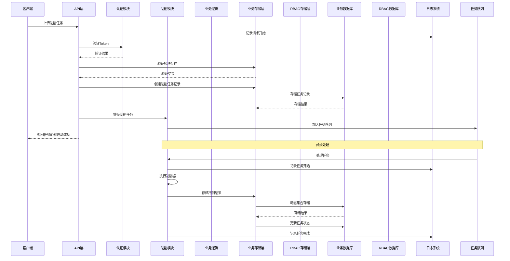

# 数据中心系统架构设计文档

## 1. 系统总体架构概述

本数据中心系统采用分层架构设计，基于Go语言、Gin框架和MongoDB构建，实现企业级数据管理、用户权限控制、日志记录和业务数据处理等核心功能。系统遵循RESTful API设计风格，提供高可用性、可扩展性和安全性。

### 1.1 架构分层

- **表现层**：基于Gin框架实现的RESTful API接口，处理HTTP请求和响应
- **业务逻辑层**：实现核心业务逻辑，包括用户认证、权限控制、数据处理、刮削任务管理等
- **数据访问层**：封装MongoDB操作，提供数据CRUD功能，支持动态集合管理
- **基础设施层**：包括日志系统、配置管理、工具函数、任务队列等

### 1.2 核心功能模块

- **用户权限系统**：基于RBAC模型的权限管理，权限和角色数据持久化存储在MongoDB的独立RBAC数据库中
- **日志系统**：基于zerolog和lumberjack的结构化日志，支持多级别日志和请求记录，HTTP日志和应用日志分离
- **业务数据管理**：按模块划分的业务数据存储，支持自定义字段、软删除和数据恢复
- **认证与授权**：基于JWT Token的认证机制，支持Token刷新和过期策略
- **查询功能**：类JIRA JQL查询语句解析器，支持复杂查询条件
- **刮削系统**：异步并发处理数据刮削任务，支持任务状态管理和重试机制

## 2. 技术选型说明及理由

| 技术/框架 | 版本 | 选型理由 |
|----------|------|----------|
| Go | 1.20+ | 编译型语言，性能优异，生态成熟，适合高并发后端服务 |
| Gin | v1.9.1 | 轻量级Web框架，性能出色，路由灵活，中间件丰富 |
| MongoDB | 6.0+ | 文档型数据库，适合存储复杂结构数据，支持动态字段，查询灵活，支持动态集合创建 |
| JWT | v5.0.0 | 无状态认证，便于水平扩展，适合前后端分离架构 |
| zerolog | v1.31.0 | 高性能结构化日志库，支持JSON格式，低内存占用 |
| lumberjack | v2.2.1 | 日志轮转工具，自动管理日志文件大小和数量 |
| bcrypt | v0.14.0 | 安全的密码哈希算法，适合用户密码存储 |
| goroutine | - | Go语言并发特性，用于异步处理刮削任务 |
| channel | - | Go语言通信机制，用于任务队列和并发控制 |

## 3. 模块划分及职责说明

### 3.1 核心模块

| 模块 | 路径 | 职责 |
|------|------|------|
| API | internal/api | 处理HTTP请求和响应，实现RESTful接口，包括RBAC相关的权限和角色管理，刮削任务管理 |
| Auth | internal/auth | 实现JWT认证和授权功能，包括密码加密和验证 |
| Logger | internal/logger | 实现日志系统和Gin日志中间件，HTTP日志和应用日志分离 |
| Models | internal/models | 定义数据模型结构，包括用户、权限、角色、刮削任务等 |
| Storage | internal/storage | 实现MongoDB数据访问层，支持动态集合管理，使用独立的数据库连接 |
| Scraper | internal/scraper | 实现数据刮削任务的异步处理，包括任务队列和并发执行 |
| JQL | pkg/jql | 实现JQL查询语句解析器 |
| RBAC | pkg/rbac | 实现基于角色的访问控制，提供权限检查和管理功能，与MongoDB集成 |

### 3.2 模块依赖关系

- API模块依赖Auth、Logger、Models、Storage和Scraper模块
- Auth模块依赖Logger模块
- Storage模块依赖Models模块
- Scraper模块依赖Logger和Storage模块
- JQL模块被API模块使用
- RBAC模块被Auth和API模块使用

## 4. 数据流图

## 5. 数据库架构

### 5.1 独立数据库设计

系统使用两个独立的MongoDB数据库，分别存储业务数据和RBAC数据：

- **业务数据库（Business Database）**：
  - 存储业务数据，包括字段定义、业务数据、已删除数据、刮削任务等
  - 支持动态集合创建，每个模块对应独立集合
  - 使用独立连接，凭据限制只能访问业务数据库
  - 配置项：`MONGODB_URI` + `MONGODB_DATABASE`

- **RBAC数据库（RBAC Database）**：
  - 存储用户、权限、角色及关联关系
  - 使用独立连接，凭据限制只能访问RBAC数据库
  - 配置项：`MONGODB_RBAC_URI` + `MONGODB_RBAC_DATABASE`

### 5.2 业务数据库集合

- **collections**：存储集合元数据
- **field_definitions**：存储字段定义
- **scrape_tasks**：存储刮削任务状态
- **{module}_data**：动态创建的业务数据集合（每个模块一个）
- **deleted_data**：存储已删除数据

### 5.3 RBAC数据库集合

- **users**：存储用户信息（嵌入role_ids数组）
- **permissions**：存储权限信息
- **roles**：存储角色信息（嵌入permission_ids数组）

## 6. 刮削系统架构

### 6.1 架构设计

刮削系统采用异步并发设计，处理长时间运行的数据刮削任务：

#### 6.1.1 核心组件
- **任务队列**：使用Go channel实现的任务队列，管理待处理的刮削任务
- **工作协程池**：多个goroutine并发处理刮削任务
- **状态管理**：在MongoDB中存储任务状态和结果
- **日志记录**：详细记录刮削过程的日志信息

#### 6.1.2 处理流程
1. 客户端上传刮削任务
2. 系统验证参数并创建任务记录
3. 任务被加入后台队列
4. 工作协程从队列中获取任务并执行
5. 执行刮削器脚本
6. 处理刮削结果并更新任务状态
7. 记录详细的刮削日志

### 6.2 任务状态管理

- **scraping**：刮削中
- **success**：刮削成功（记录保留）
- **failed**：刮削失败（记录保留，可重试）

## 7. RBAC系统实现架构

### 7.1 架构设计

RBAC（基于角色的访问控制）系统采用分层设计，使用独立的MongoDB数据库存储权限数据，实现权限数据的持久化存储。系统由以下核心组件组成：

#### 7.1.1 存储层
- **RBACStorage接口**：定义了用户、权限、角色管理的核心方法，包括创建、获取、更新、删除操作，以及用户角色关联和角色权限关联的操作
- **rbacMongoDBStorage**：独立的MongoDB存储实现，创建独立的数据库连接，使用独立的数据库凭据，确保业务数据库用户无法访问RBAC数据库

#### 7.1.2 服务层
- **RBAC Service**：提供权限检查和管理功能，包括：
  - 检查用户是否具有指定权限
  - 获取用户所有权限
  - 根据角色代码获取权限列表
  - 检查角色和权限是否有效

#### 7.1.3 数据模型
- **Permission**：权限模型，包含权限名称、代码和描述
- **Role**：角色模型，包含角色名称、代码、描述和permission_ids数组
- **User**：用户模型，包含用户信息和role_ids数组

### 7.2 核心流程

#### 7.2.1 权限检查流程
1. 客户端发起API请求，携带JWT Token
2. 认证中间件验证Token，提取用户信息
3. RBAC服务从RBAC数据库获取用户的角色列表
4. 对每个角色，获取其权限列表
5. 合并所有权限并检查用户是否具有执行操作所需的权限
6. 根据检查结果允许或拒绝操作

#### 7.2.2 权限管理流程
1. 管理员创建权限和角色
2. 管理员将权限分配给角色
3. 管理员将角色分配给用户
4. 系统在RBAC数据库中更新相应的嵌入数组

### 7.3 安全设计

- 使用JWT Token进行身份认证，Token包含用户身份、角色和权限信息
- 实现Token过期策略和刷新机制，提高安全性
- 基于RBAC模型的权限控制，细粒度管理用户权限
- 权限和角色数据持久化存储在独立的RBAC数据库中
- 业务数据库用户和RBAC数据库用户使用不同的凭据，实现权限隔离
- 记录权限变更操作，实现完整的审计日志

## 8. 日志系统设计

### 8.1 日志分层

- **HTTP日志**：记录所有API请求和响应信息，使用独立的日志文件
  - 包含：用户ID、请求方法、路径、查询参数、状态码、响应时间、客户端IP、用户代理
  - 存储位置：`logs/http.log`
  - 配置项：`LOG_HTTP_FILE`

- **应用日志**：记录应用程序运行时的日志信息
  - 包含：错误信息、警告、信息性消息
  - 存储位置：`logs/app.log`（文件）和控制台
  - 配置项：`LOG_LEVEL`

- **刮削日志**：记录刮削任务的执行情况
  - 包含：任务ID、模块、数据路径、刮削器路径、状态、执行时间
  - 存储位置：`logs/scraper.log`
  - 配置项：`LOG_SCRAPER_FILE`

- **审计日志**：记录权限变更和重要操作
  - 包含：用户ID、操作类型、操作对象、操作结果
  - 存储位置：`logs/audit.log`
  - 配置项：`LOG_AUDIT_FILE`

### 8.2 日志轮转

- 使用lumberjack实现日志文件自动轮转
- 配置参数：
  - `LOG_MAX_SIZE`：日志文件最大大小（MB）
  - `LOG_MAX_BACKUPS`：最多保留的日志文件数
  - `LOG_MAX_AGE`：日志文件最大保留天数

### 8.3 日志格式

- 使用zerolog的JSON格式，便于后续分析和处理
- 包含时间戳、日志级别、调用位置等信息

### 8.4 日志记录点

系统在以下关键节点记录日志：

1. **刮削相关**
   - 任务创建
   - 任务开始执行
   - 任务执行完成（成功/失败）
   - 任务重试

2. **集合管理**
   - 集合创建
   - 集合更新
   - 集合删除
   - 索引管理操作

3. **权限管理**
   - 角色创建
   - 角色分配
   - 角色撤销
   - 权限变更

4. **数据操作**
   - 数据创建
   - 数据更新
   - 数据删除
   - 数据查询（重要操作）

## 9. 系统安全设计

### 9.1 数据安全

- 密码加密存储，使用bcrypt等安全哈希算法
- 敏感数据传输使用HTTPS加密
- 实现数据访问控制，确保用户只能访问授权范围内的数据
- 业务数据库和RBAC数据库使用独立的连接和凭据

### 9.2 日志与审计

- 记录所有权限变更操作，实现完整的审计日志
- 记录API请求和响应信息，便于问题排查和安全审计
- 记录刮削任务执行情况，便于故障排查
- 定期清理过期日志，避免存储空间浪费

### 9.3 其他安全措施

- 实现请求速率限制，防止暴力攻击
- 输入验证和参数校验，防止注入攻击
- 定期更新依赖库，修复已知安全漏洞
- 刮削器执行环境隔离，防止恶意代码执行
