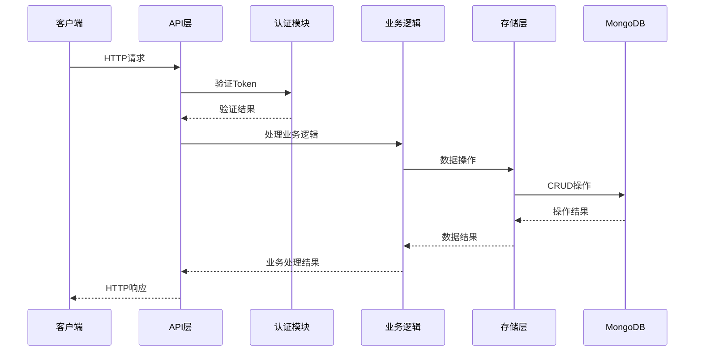

# 数据中心系统架构设计文档

## 1. 系统总体架构概述

本数据中心系统采用分层架构设计，基于Go语言、Gin框架和MongoDB构建，实现企业级数据管理、用户权限控制、日志记录和业务数据处理等核心功能。系统遵循RESTful API设计风格，提供高可用性、可扩展性和安全性。

### 1.1 架构分层

- **表现层**：基于Gin框架实现的RESTful API接口，处理HTTP请求和响应
- **业务逻辑层**：实现核心业务逻辑，包括用户认证、权限控制、数据处理等
- **数据访问层**：封装MongoDB操作，提供数据CRUD功能
- **基础设施层**：包括日志系统、配置管理、工具函数等

### 1.2 核心功能模块

- **用户权限系统**：基于RBAC模型的权限管理，支持root、datatypeowner和dataowner三种角色，权限和角色数据持久化存储在MongoDB中
- **日志系统**：基于zerolog和lumberjack的结构化日志，支持多级别日志和请求记录
- **业务数据管理**：按模块划分的业务数据存储，支持自定义字段、软删除和数据恢复
- **认证与授权**：基于JWT Token的认证机制，支持Token刷新和过期策略
- **查询功能**：类JIRA JQL查询语句解析器，支持复杂查询条件

## 2. 技术选型说明及理由

| 技术/框架 | 版本 | 选型理由 |
|----------|------|----------|
| Go | 1.20+ | 编译型语言，性能优异，生态成熟，适合高并发后端服务 |
| Gin | v1.9.1 | 轻量级Web框架，性能出色，路由灵活，中间件丰富 |
| MongoDB | 6.0+ | 文档型数据库，适合存储复杂结构数据，支持动态字段，查询灵活 |
| JWT | v5.0.0 | 无状态认证，便于水平扩展，适合前后端分离架构 |
| zerolog | v1.31.0 | 高性能结构化日志库，支持JSON格式，低内存占用 |
| lumberjack | v2.2.1 | 日志轮转工具，自动管理日志文件大小和数量 |
| bcrypt | v0.14.0 | 安全的密码哈希算法，适合用户密码存储 |

## 3. 模块划分及职责说明

### 3.1 核心模块

| 模块 | 路径 | 职责 |
|------|------|------|
| API | internal/api | 处理HTTP请求和响应，实现RESTful接口，包括RBAC相关的权限和角色管理 |
| Auth | internal/auth | 实现JWT认证和授权功能，包括密码加密和验证 |
| Logger | internal/logger | 实现日志系统和Gin日志中间件 |
| Models | internal/models | 定义数据模型结构，包括用户、权限、角色等 |
| Storage | internal/storage | 实现MongoDB数据访问层，包括RBAC数据的CRUD操作 |
| Utils | internal/utils | 提供通用工具函数 |
| JQL | pkg/jql | 实现JQL查询语句解析器 |
| RBAC | pkg/rbac | 实现基于角色的访问控制，提供权限检查和默认角色定义 |

### 3.2 模块依赖关系

- API模块依赖Auth、Logger、Models和Storage模块
- Auth模块依赖Logger模块
- Storage模块依赖Models模块
- JQL模块被API模块使用
- RBAC模块被Auth和API模块使用

## 4. 数据流图

## 5. 系统安全设计

### 5.1 认证与授权

- 使用JWT Token进行身份认证，Token包含用户身份、角色和权限信息
- 实现Token过期策略和刷新机制，提高安全性
- 基于RBAC模型的权限控制，细粒度管理用户权限
- 权限和角色数据持久化存储在MongoDB的user数据库中

### 5.2 数据安全

- 密码加密存储，使用bcrypt等安全哈希算法
- 敏感数据传输使用HTTPS加密
- 实现数据访问控制，确保用户只能访问授权范围内的数据

### 5.3 日志与审计

- 记录所有权限变更操作，实现完整的审计日志
- 记录API请求和响应信息，便于问题排查和安全审计
- 定期清理过期日志，避免存储空间浪费

### 5.4 其他安全措施

- 实现请求速率限制，防止暴力攻击
- 输入验证和参数校验，防止注入攻击
- 定期更新依赖库，修复已知安全漏洞
