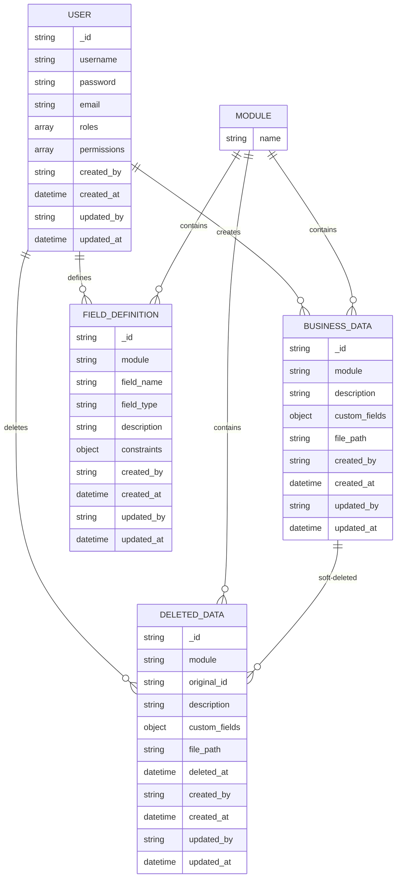
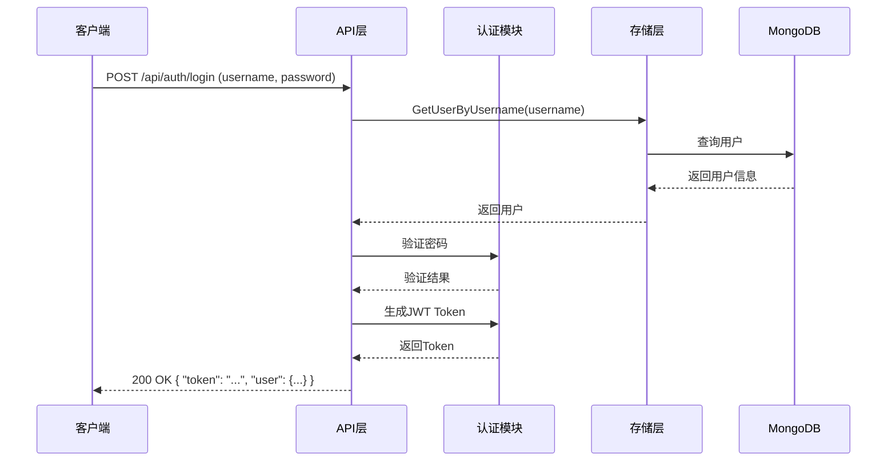
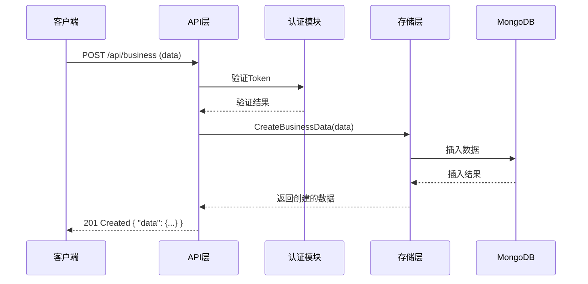
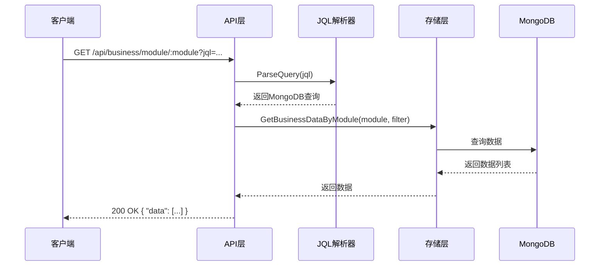
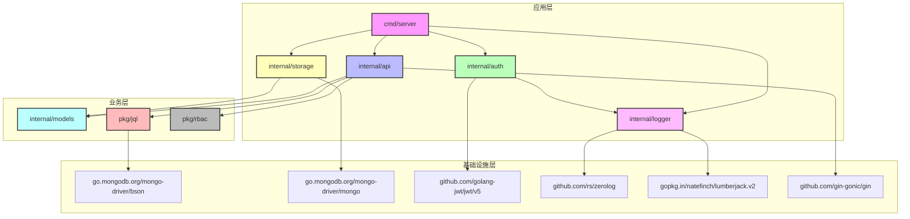
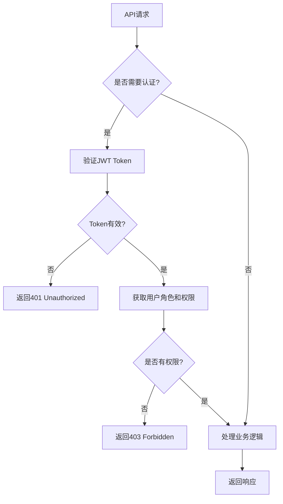
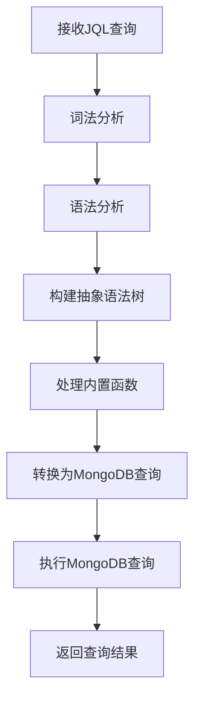
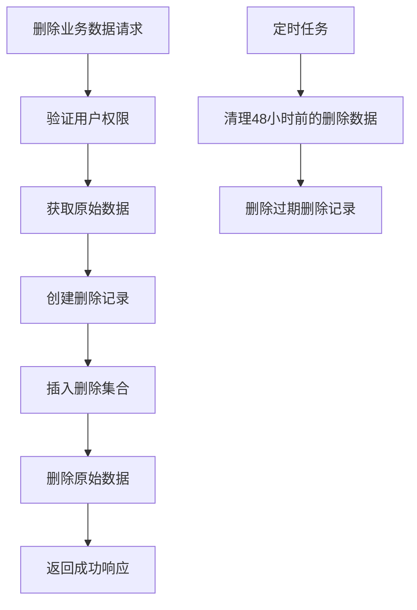
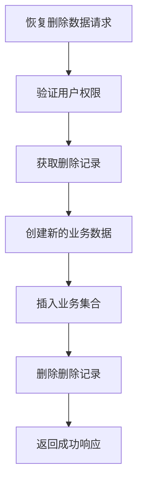

# 数据中心系统架构图

## 1. 系统实体关系图 (ERD)

```mermaid
erDiagram
    USER ||--o{ BUSINESS_DATA : "creates"
    USER ||--o{ FIELD_DEFINITION : "defines"
    USER ||--o{ DELETED_DATA : "deletes"
    MODULE ||--o{ BUSINESS_DATA : "contains"
    MODULE ||--o{ FIELD_DEFINITION : "contains"
    MODULE ||--o{ DELETED_DATA : "contains"
    BUSINESS_DATA ||--o{ DELETED_DATA : "soft-deleted"

    USER {
        string _id
        string username
        string password
        string email
        array roles
        array permissions
        string created_by
        datetime created_at
        string updated_by
        datetime updated_at
    }

    MODULE {
        string name
    }

    FIELD_DEFINITION {
        string _id
        string module
        string field_name
        string field_type
        string description
        object constraints
        string created_by
        datetime created_at
        string updated_by
        datetime updated_at
    }

    BUSINESS_DATA {
        string _id
        string module
        string description
        object custom_fields
        string file_path
        string created_by
        datetime created_at
        string updated_by
        datetime updated_at
    }

    DELETED_DATA {
        string _id
        string module
        string original_id
        string description
        object custom_fields
        string file_path
        datetime deleted_at
        string created_by
        datetime created_at
        string updated_by
        datetime updated_at
    }
```

## 2. 核心业务时序图

### 2.1 用户登录流程

```mermaid
sequenceDiagram
    participant Client as 客户端
    participant API as API层
    participant Auth as 认证模块
    participant Storage as 存储层
    participant MongoDB as MongoDB

    Client->>API: POST /api/auth/login (username, password)
    API->>Storage: GetUserByUsername(username)
    Storage->>MongoDB: 查询用户
    MongoDB-->>Storage: 返回用户信息
    Storage-->>API: 返回用户
    API->>Auth: 验证密码
    Auth-->>API: 验证结果
    API->>Auth: 生成JWT Token
    Auth-->>API: 返回Token
    API-->>Client: 200 OK { "token": "...", "user": {...} }
```

### 2.2 创建业务数据流程

```mermaid
sequenceDiagram
    participant Client as 客户端
    participant API as API层
    participant Auth as 认证模块
    participant Storage as 存储层
    participant MongoDB as MongoDB

    Client->>API: POST /api/business (data)
    API->>Auth: 验证Token
    Auth-->>API: 验证结果
    API->>Storage: CreateBusinessData(data)
    Storage->>MongoDB: 插入数据
    MongoDB-->>Storage: 插入结果
    Storage-->>API: 返回创建的数据
    API-->>Client: 201 Created { "data": {...} }
```

### 2.3 JQL查询流程

```mermaid
sequenceDiagram
    participant Client as 客户端
    participant API as API层
    participant JQL as JQL解析器
    participant Storage as 存储层
    participant MongoDB as MongoDB

    Client->>API: GET /api/business/module/:module?jql=...
    API->>JQL: ParseQuery(jql)
    JQL-->>API: 返回MongoDB查询
    API->>Storage: GetBusinessDataByModule(module, filter)
    Storage->>MongoDB: 查询数据
    MongoDB-->>Storage: 返回数据列表
    Storage-->>API: 返回数据
    API-->>Client: 200 OK { "data": [...] }
```

## 3. 模块依赖图

```mermaid
graph TD
    subgraph 应用层
        A[cmd/server] --> B[internal/api]
        A --> C[internal/auth]
        A --> D[internal/logger]
        A --> E[internal/storage]
    end

    subgraph 业务层
        B --> F[internal/models]
        B --> G[pkg/jql]
        B --> H[pkg/rbac]
        C --> D
        E --> F
    end

    subgraph 基础设施层
        G --> I[go.mongodb.org/mongo-driver/bson]
        E --> J[go.mongodb.org/mongo-driver/mongo]
        C --> K[github.com/golang-jwt/jwt/v5]
        D --> L[github.com/rs/zerolog]
        D --> M[gopkg.in/natefinch/lumberjack.v2]
        B --> N[github.com/gin-gonic/gin]
    end

    style A fill:#f9f,stroke:#333,stroke-width:2px
    style B fill:#bbf,stroke:#333,stroke-width:2px
    style C fill:#bfb,stroke:#333,stroke-width:2px
    style D fill:#fbf,stroke:#333,stroke-width:2px
    style E fill:#ffb,stroke:#333,stroke-width:2px
    style F fill:#bff,stroke:#333,stroke-width:2px
    style G fill:#fbb,stroke:#333,stroke-width:2px
    style H fill:#bbb,stroke:#333,stroke-width:2px
```

## 4. 权限控制流程图

```mermaid
flowchart TD
    A[API请求] --> B{是否需要认证?}
    B -->|是| C[验证JWT Token]
    C --> D{Token有效?}
    D -->|否| E[返回401 Unauthorized]
    D -->|是| F[获取用户角色和权限]
    F --> G{是否有权限?}
    G -->|否| H[返回403 Forbidden]
    G -->|是| I[处理业务逻辑]
    B -->|否| I
    I --> J[返回响应]
```

## 5. JQL查询处理流程图

```mermaid
flowchart TD
    A[接收JQL查询] --> B[词法分析]
    B --> C[语法分析]
    C --> D[构建抽象语法树]
    D --> E[处理内置函数]
    E --> F[转换为MongoDB查询]
    F --> G[执行MongoDB查询]
    G --> H[返回查询结果]
```

## 6. 数据删除流程

```mermaid
flowchart TD
    A[删除业务数据请求] --> B[验证用户权限]
    B --> C[获取原始数据]
    C --> D[创建删除记录]
    D --> E[插入删除集合]
    E --> F[删除原始数据]
    F --> G[返回成功响应]
    
    H[定时任务] --> I[清理48小时前的删除数据]
    I --> J[删除过期删除记录]
```

## 7. 数据恢复流程

```mermaid
flowchart TD
    A[恢复删除数据请求] --> B[验证用户权限]
    B --> C[获取删除记录]
    C --> D[创建新的业务数据]
    D --> E[插入业务集合]
    E --> F[删除删除记录]
    F --> G[返回成功响应]
```
