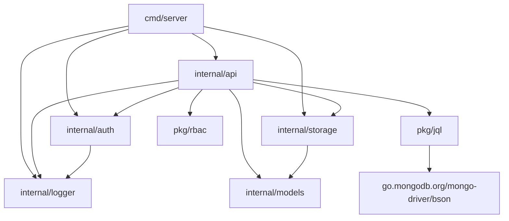

# 数据中心系统代码结构设计文档

## 1. 项目目录结构

```
datacenter/
├── cmd/
│   └── server/
│       └── main.go        # 主入口文件
├── configs/
│   └── config.yaml       # 配置文件模板
├── docs/
│   ├── architecture.md   # 架构设计文档
│   ├── requirements.md   # 需求设计文档
│   └── code_structure.md # 代码结构设计文档
├── internal/
│   ├── api/              # API层
│   │   └── handlers.go   # API处理器
│   ├── auth/             # 认证模块
│   │   ├── jwt.go        # JWT实现
│   │   └── middleware.go # 认证中间件
│   ├── logger/           # 日志系统
│   │   ├── logger.go     # 日志初始化
│   │   └── middleware.go # Gin日志中间件
│   ├── models/           # 数据模型
│   │   └── models.go     # 模型定义
│   ├── storage/          # 存储层
│   │   └── mongodb.go    # MongoDB实现
│   └── utils/            # 工具函数
├── pkg/
│   ├── jql/              # JQL解析器
│   │   └── parser.go     # JQL解析实现
│   └── rbac/             # RBAC权限系统
│       └── rbac.go       # 权限定义和检查
├── go.mod                # Go模块文件
└── README.md             # 项目说明
```

## 2. 包划分及依赖关系

### 2.1 包划分

| 包 | 路径 | 职责 |
|----|------|------|
| cmd/server | cmd/server/ | 应用程序入口，初始化和启动服务器 |
| configs | configs/ | 配置文件管理 |
| internal/api | internal/api/ | HTTP请求处理，实现RESTful接口，包括RBAC相关的权限和角色管理 |
| internal/auth | internal/auth/ | JWT认证和授权功能，包括密码加密和验证 |
| internal/logger | internal/logger/ | 日志系统和Gin日志中间件 |
| internal/models | internal/models/ | 数据模型定义，包括用户、权限、角色等 |
| internal/storage | internal/storage/ | MongoDB数据访问层，包括RBAC数据的CRUD操作 |
| internal/utils | internal/utils/ | 通用工具函数 |
| pkg/jql | pkg/jql/ | JQL查询语句解析器 |
| pkg/rbac | pkg/rbac/ | 基于角色的访问控制，提供权限检查和默认角色定义 |

### 2.2 依赖关系



## 3. 核心模块伪代码

### 3.1 主入口文件 (cmd/server/main.go)

```go
package main

import (
	"context"
	"fmt"
	"log"
	"net/http"
	"os"
	"os/signal"
	"syscall"
	"time"

	"github.com/gin-gonic/gin"
	"github.com/joho/godotenv"
	"datacenter/internal/api"
	"datacenter/internal/auth"
	"datacenter/internal/logger"
	"datacenter/internal/storage"
)

func main() {
	// 加载环境变量
	if err := godotenv.Load(); err != nil {
		log.Println("No .env file found, using system environment variables")
	}

	// 初始化日志系统
	logger.Init(config.Logger.Level, config.Logger.FilePath, config.Logger.MaxSize, config.Logger.MaxBackups, config.Logger.MaxAge)

	// 初始化存储层（业务数据）
	businessStorage, err := storage.NewMongoDBStorage(config.MongoDB.URI, config.MongoDB.Database)
	if err != nil {
		log.Fatalf("Failed to initialize storage: %v", err)
	}

	// 初始化用户存储（RBAC专用）
	userStorage, err := storage.NewMongoDBStorage(config.MongoDB.URI, "user")
	if err != nil {
		log.Fatalf("Failed to initialize user storage: %v", err)
	}

	// 初始化默认权限和角色
	if err := userStorage.InitDefaultData(); err != nil {
		log.Fatalf("Failed to initialize default data: %v", err)
	}

	// 初始化JWT服务
	jwtService := auth.NewJWTService(config.JWT.Secret, config.JWT.Expiration, config.JWT.RefreshExpiration)

	// 初始化API处理器
	handler := api.NewHandler(businessStorage, userStorage)

	// 初始化Gin引擎
	router := gin.Default()

	// 添加中间件
	router.Use(logger.LoggerMiddleware())

	// 注册路由
	handler.RegisterRoutes(router, jwtService)

	// 启动服务器
	serverAddr := fmt.Sprintf("%s:%d", config.Server.Host, config.Server.Port)
	log.Printf("Server starting on %s", serverAddr)
	if err := router.Run(serverAddr); err != nil {
		log.Fatalf("Failed to start server: %v", err)
	}
}

func loadConfig() Config {
	// 加载配置文件
	// ...
	return Config{}
}
```

### 3.2 API处理器 (internal/api/handlers.go)

```go
package api

import (
	"net/http"

	"github.com/gin-gonic/gin"
	"datacenter/internal/models"
	"datacenter/internal/storage"
)

type Handler struct {
	storage     storage.Storage
	userStorage storage.Storage
}

func NewHandler(storage, userStorage storage.Storage) *Handler {
	return &Handler{
		storage:     storage,
		userStorage: userStorage,
	}
}

func (h *Handler) RegisterRoutes(router *gin.Engine, jwtService auth.JWTService) {
	// 注册路由
	// 公开路由
	// 受保护路由
	// 用户管理路由
	// 权限管理路由
	// 角色管理路由
	// 字段定义路由
	// 业务数据路由
	// 已删除数据路由
}

// 用户管理相关方法
func (h *Handler) CreateUser(c *gin.Context) { /* ... */ }
func (h *Handler) GetUsers(c *gin.Context) { /* ... */ }
func (h *Handler) GetUserByID(c *gin.Context) { /* ... */ }
func (h *Handler) UpdateUser(c *gin.Context) { /* ... */ }
func (h *Handler) DeleteUser(c *gin.Context) { /* ... */ }
func (h *Handler) AssignRoleToUser(c *gin.Context) { /* ... */ }
func (h *Handler) RemoveRoleFromUser(c *gin.Context) { /* ... */ }
func (h *Handler) GetUserRoles(c *gin.Context) { /* ... */ }

// 权限管理相关方法
func (h *Handler) CreatePermission(c *gin.Context) { /* ... */ }
func (h *Handler) GetPermissions(c *gin.Context) { /* ... */ }
func (h *Handler) GetPermissionByID(c *gin.Context) { /* ... */ }
func (h *Handler) UpdatePermission(c *gin.Context) { /* ... */ }
func (h *Handler) DeletePermission(c *gin.Context) { /* ... */ }

// 角色管理相关方法
func (h *Handler) CreateRole(c *gin.Context) { /* ... */ }
func (h *Handler) GetRoles(c *gin.Context) { /* ... */ }
func (h *Handler) GetRoleByID(c *gin.Context) { /* ... */ }
func (h *Handler) UpdateRole(c *gin.Context) { /* ... */ }
func (h *Handler) DeleteRole(c *gin.Context) { /* ... */ }
func (h *Handler) AssignPermissionToRole(c *gin.Context) { /* ... */ }
func (h *Handler) RemovePermissionFromRole(c *gin.Context) { /* ... */ }
func (h *Handler) GetRolePermissions(c *gin.Context) { /* ... */ }

// 其他业务方法...
```

### 3.3 存储层 (internal/storage/mongodb.go)

```go
package storage

import (
	"context"

	"go.mongodb.org/mongo-driver/mongo"
	"datacenter/internal/models"
)

type Storage interface {
	// 用户相关
	CreateUser(user *models.User) error
	GetUserByID(id string) (*models.User, error)
	GetUserByUsername(username string) (*models.User, error)
	UpdateUser(user *models.User) error
	DeleteUser(id string) error
	GetUsers(skip, limit int64) ([]models.User, error)

	// 字段定义相关
	CreateFieldDefinition(field *models.FieldDefinition) error
	GetFieldDefinitionByID(id string) (*models.FieldDefinition, error)
	GetFieldDefinitionsByModule(module string) ([]models.FieldDefinition, error)
	UpdateFieldDefinition(field *models.FieldDefinition) error
	DeleteFieldDefinition(id string) error

	// 业务数据相关
	CreateBusinessData(data *models.BusinessData) error
	GetBusinessDataByID(id string) (*models.BusinessData, error)
	GetBusinessDataByModule(module string, filter bson.M, skip, limit int64) ([]models.BusinessData, error)
	UpdateBusinessData(data *models.BusinessData) error
	DeleteBusinessData(id string, userID string) error

	// 已删除数据相关
	GetDeletedDataByID(id string) (*models.DeletedData, error)
	GetDeletedDataByModule(module string, skip, limit int64) ([]models.DeletedData, error)
	RecoverDeletedData(id string, userID string) error
	CleanupDeletedData(olderThan time.Time) error

	// 权限相关
	CreatePermission(permission *models.Permission) error
	GetPermissionByID(id string) (*models.Permission, error)
	GetPermissionByCode(code string) (*models.Permission, error)
	GetPermissions(skip, limit int64) ([]models.Permission, error)
	UpdatePermission(permission *models.Permission) error
	DeletePermission(id string) error

	// 角色相关
	CreateRole(role *models.Role) error
	GetRoleByID(id string) (*models.Role, error)
	GetRoleByCode(code string) (*models.Role, error)
	GetRoles(skip, limit int64) ([]models.Role, error)
	UpdateRole(role *models.Role) error
	DeleteRole(id string) error

	// 用户角色关联
	AssignRoleToUser(userID, roleID, operatorID string) error
	RemoveRoleFromUser(userID, roleID string) error
	GetUserRoles(userID string) ([]models.Role, error)

	// 角色权限关联
	AssignPermissionToRole(roleID, permissionID, operatorID string) error
	RemovePermissionFromRole(roleID, permissionID string) error
	GetRolePermissions(roleID string) ([]models.Permission, error)

	// 初始化默认数据
	InitDefaultData() error
}

type mongodbStorage struct {
	client         *mongo.Client
	database       *mongo.Database
	users          *mongo.Collection
	fields         *mongo.Collection
	business       *mongo.Collection
	deleted        *mongo.Collection
	auditLogs      *mongo.Collection
	permissions    *mongo.Collection
	roles          *mongo.Collection
	userRoles      *mongo.Collection
	rolePermissions *mongo.Collection
}

func NewMongoDBStorage(uri, databaseName string) (Storage, error) {
	// 初始化MongoDB客户端
	// ...
	return &mongodbStorage{}, nil
}

// 实现Storage接口的所有方法...
```

### 3.4 认证模块 (internal/auth/jwt.go)

```go
package auth

import (
	"errors"
	"time"

	"github.com/golang-jwt/jwt/v5"
	"golang.org/x/crypto/bcrypt"
)

type Claims struct {
	UserID   string   `json:"user_id"`
	Roles    []string `json:"roles"`
	Permissions []string `json:"permissions"`
	jwt.RegisteredClaims
}

type JWTService interface {
	GenerateToken(userID string, roles, permissions []string) (string, error)
	ValidateToken(tokenString string) (*Claims, error)
	RefreshToken(tokenString string) (string, error)
}

type jwtService struct {
	secretKey         string
	tokenExpiration   time.Duration
	refreshExpiration time.Duration
}

func NewJWTService(secretKey string, tokenExpiration, refreshExpiration time.Duration) JWTService {
	return &jwtService{
		secretKey:         secretKey,
		tokenExpiration:   tokenExpiration,
		refreshExpiration: refreshExpiration,
	}
}

// 实现JWTService接口的方法...

// HashPassword 加密密码
func HashPassword(password string) (string, error) {
	hash, err := bcrypt.GenerateFromPassword([]byte(password), bcrypt.DefaultCost)
	if err != nil {
		return "", err
	}
	return string(hash), nil
}

// CheckPassword 验证密码
func CheckPassword(password, hash string) error {
	return bcrypt.CompareHashAndPassword([]byte(hash), []byte(password))
}
```

## 4. 接口定义

### 4.1 存储接口 (internal/storage/mongodb.go)

```go
// Storage 存储接口
type Storage interface {
	// 用户相关
	CreateUser(user *models.User) error
	GetUserByID(id string) (*models.User, error)
	GetUserByUsername(username string) (*models.User, error)
	UpdateUser(user *models.User) error
	DeleteUser(id string) error
	GetUsers(skip, limit int64) ([]models.User, error)

	// 字段定义相关
	CreateFieldDefinition(field *models.FieldDefinition) error
	GetFieldDefinitionByID(id string) (*models.FieldDefinition, error)
	GetFieldDefinitionsByModule(module string) ([]models.FieldDefinition, error)
	UpdateFieldDefinition(field *models.FieldDefinition) error
	DeleteFieldDefinition(id string) error

	// 业务数据相关
	CreateBusinessData(data *models.BusinessData) error
	GetBusinessDataByID(id string) (*models.BusinessData, error)
	GetBusinessDataByModule(module string, filter bson.M, skip, limit int64) ([]models.BusinessData, error)
	UpdateBusinessData(data *models.BusinessData) error
	DeleteBusinessData(id string, userID string) error

	// 已删除数据相关
	GetDeletedDataByID(id string) (*models.DeletedData, error)
	GetDeletedDataByModule(module string, skip, limit int64) ([]models.DeletedData, error)
	RecoverDeletedData(id string, userID string) error
	CleanupDeletedData(olderThan time.Time) error

	// 权限相关
	CreatePermission(permission *models.Permission) error
	GetPermissionByID(id string) (*models.Permission, error)
	GetPermissionByCode(code string) (*models.Permission, error)
	GetPermissions(skip, limit int64) ([]models.Permission, error)
	UpdatePermission(permission *models.Permission) error
	DeletePermission(id string) error

	// 角色相关
	CreateRole(role *models.Role) error
	GetRoleByID(id string) (*models.Role, error)
	GetRoleByCode(code string) (*models.Role, error)
	GetRoles(skip, limit int64) ([]models.Role, error)
	UpdateRole(role *models.Role) error
	DeleteRole(id string) error

	// 用户角色关联
	AssignRoleToUser(userID, roleID, operatorID string) error
	RemoveRoleFromUser(userID, roleID string) error
	GetUserRoles(userID string) ([]models.Role, error)

	// 角色权限关联
	AssignPermissionToRole(roleID, permissionID, operatorID string) error
	RemovePermissionFromRole(roleID, permissionID string) error
	GetRolePermissions(roleID string) ([]models.Permission, error)

	// 初始化默认数据
	InitDefaultData() error
}
```

### 4.2 JWT服务接口 (internal/auth/jwt.go)

```go
// JWTService JWT服务接口
type JWTService interface {
	GenerateToken(userID string, roles, permissions []string) (string, error)
	ValidateToken(tokenString string) (*Claims, error)
	RefreshToken(tokenString string) (string, error)
}
```

### 4.3 API处理器接口 (internal/api/handlers.go)

```go
// Handler API处理器
type Handler struct {
	storage     storage.Storage
	userStorage storage.Storage
}

func NewHandler(storage, userStorage storage.Storage) *Handler
func (h *Handler) RegisterRoutes(router *gin.Engine, jwtService auth.JWTService)

// 用户管理
func (h *Handler) Login(c *gin.Context)
func (h *Handler) CreateUser(c *gin.Context)
func (h *Handler) GetUsers(c *gin.Context)
func (h *Handler) GetUserByID(c *gin.Context)
func (h *Handler) UpdateUser(c *gin.Context)
func (h *Handler) DeleteUser(c *gin.Context)
func (h *Handler) AssignRoleToUser(c *gin.Context)
func (h *Handler) RemoveRoleFromUser(c *gin.Context)
func (h *Handler) GetUserRoles(c *gin.Context)

// 权限管理
func (h *Handler) CreatePermission(c *gin.Context)
func (h *Handler) GetPermissions(c *gin.Context)
func (h *Handler) GetPermissionByID(c *gin.Context)
func (h *Handler) UpdatePermission(c *gin.Context)
func (h *Handler) DeletePermission(c *gin.Context)

// 角色管理
func (h *Handler) CreateRole(c *gin.Context)
func (h *Handler) GetRoles(c *gin.Context)
func (h *Handler) GetRoleByID(c *gin.Context)
func (h *Handler) UpdateRole(c *gin.Context)
func (h *Handler) DeleteRole(c *gin.Context)
func (h *Handler) AssignPermissionToRole(c *gin.Context)
func (h *Handler) RemovePermissionFromRole(c *gin.Context)
func (h *Handler) GetRolePermissions(c *gin.Context)

// 字段定义管理
func (h *Handler) CreateFieldDefinition(c *gin.Context)
func (h *Handler) GetFieldDefinitionsByModule(c *gin.Context)
func (h *Handler) GetFieldDefinitionByID(c *gin.Context)
func (h *Handler) UpdateFieldDefinition(c *gin.Context)
func (h *Handler) DeleteFieldDefinition(c *gin.Context)

// 业务数据管理
func (h *Handler) CreateBusinessData(c *gin.Context)
func (h *Handler) GetBusinessDataByModule(c *gin.Context)
func (h *Handler) GetBusinessDataByID(c *gin.Context)
func (h *Handler) UpdateBusinessData(c *gin.Context)
func (h *Handler) DeleteBusinessData(c *gin.Context)

// 已删除数据管理
func (h *Handler) GetDeletedDataByModule(c *gin.Context)
func (h *Handler) GetDeletedDataByID(c *gin.Context)
func (h *Handler) RecoverDeletedData(c *gin.Context)
```

## 5. 配置文件规范

### 5.1 配置文件结构 (configs/config.yaml)

```yaml
# MongoDB配置
mongodb:
  uri: "mongodb://localhost:27017"
  database: "datacenter"

# JWT配置
jwt:
  secret: "your-secret-key"
  expiration: 24h
  refresh_expiration: 720h

# 日志配置
logger:
  level: "info"
  file_path: "logs/app.log"
  max_size: 100
  max_backups: 5
  max_age: 30

# 服务器配置
server:
  port: 8080
  host: "0.0.0.0"
  read_timeout: 10s
  write_timeout: 10s

# TLS配置
tls:
  cert: "cert.pem"
  key: "key.pem"
```

### 5.2 配置加载

- 使用viper库加载配置文件
- 支持环境变量覆盖配置
- 提供默认配置值

### 5.3 配置结构

```go
type Config struct {
	MongoDB struct {
		URI      string `mapstructure:"uri"`
		Database string `mapstructure:"database"`
	} `mapstructure:"mongodb"`

	JWT struct {
		Secret           string        `mapstructure:"secret"`
		Expiration       time.Duration `mapstructure:"expiration"`
		RefreshExpiration time.Duration `mapstructure:"refresh_expiration"`
	} `mapstructure:"jwt"`

	Logger struct {
		Level     string `mapstructure:"level"`
		FilePath  string `mapstructure:"file_path"`
		MaxSize   int    `mapstructure:"max_size"`
		MaxBackups int    `mapstructure:"max_backups"`
		MaxAge    int    `mapstructure:"max_age"`
	} `mapstructure:"logger"`

	Server struct {
		Port         int           `mapstructure:"port"`
		Host         string        `mapstructure:"host"`
		ReadTimeout  time.Duration `mapstructure:"read_timeout"`
		WriteTimeout time.Duration `mapstructure:"write_timeout"`
	} `mapstructure:"server"`

	TLS struct {
		Cert string `mapstructure:"cert"`
		Key  string `mapstructure:"key"`
	} `mapstructure:"tls"`
}
```
