# 用户权限系统 (RBAC)

## 1. 角色定义

### 1.1 预定义角色

- **root用户**：系统最高权限，可管理所有数据库和用户
- **datatypeowner**：数据库类型所有者，具备以下权限：
  - 定义所属database中datacollection的自定义字段
  - 创建和管理集合对应的角色
  - 为其他用户授予集合对应的角色
- **dataowner**：数据所有者，具备以下权限：
  - 对所属database的数据进行增删改查操作
  - 只能使用datatypeowner定义的key添加自定义字段

### 1.2 集合专用角色

每个集合自动创建以下角色：

| 角色    | 代码               | 权限                              | 描述     |
| ----- | ---------------- | ------------------------------- | ------ |
| 集合管理员 | {module}\_admin  | read,create,update,delete,admin | 完全控制权限 |
| 集合用户  | {module}\_user   | read,create,update              | 基础操作权限 |
| 集合只读  | {module}\_viewer | read                            | 只读权限   |

## 2. 权限管理

### 2.1 基本要求

- 权限系统需嵌入完整审计(audit)数据，记录所有权限变更操作
- 支持角色分配和权限检查
- 实现权限验证中间件，保护API端点
- 权限和角色数据持久化存储在MongoDB的RBAC数据库中
- 支持创建自定义角色和权限
- 支持角色与用户的绑定和解绑（多对多关系）
- 支持角色与权限的绑定和解绑（多对多关系）

### 2.2 多对多关系设计

RBAC系统实现完整的多对多关系：

- **用户-角色关系**：一个用户可以拥有多个角色，一个角色可以分配给多个用户
- **角色-权限关系**：一个角色可以拥有多个权限，一个权限可以分配给多个角色
- **权限继承**：用户通过角色间接拥有权限，用户拥有的全部权限是所有角色权限的并集

### 2.3 MongoDB存储范式（嵌入方案B）

本系统采用**嵌入方案B**实现RBAC多对多关系，通过在用户和角色文档中嵌入关联ID数组，利用MongoDB数组操作符实现关系的动态管理。

#### 2.3.1 实体关系图（ER Diagram）

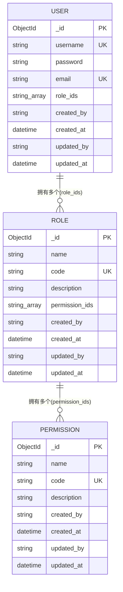

#### 2.3.2 MongoDB文档结构

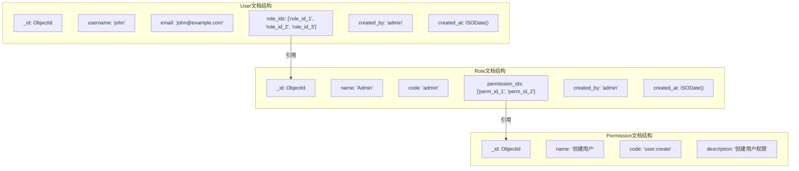

#### 2.3.3 权限继承流程

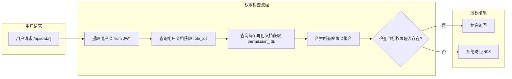

### 2.4 MongoDB数组操作

#### 2.4.1 分配角色（$addToSet）

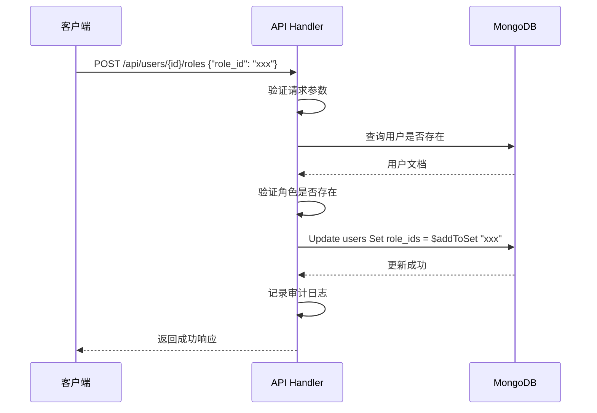

#### 2.4.2 移除角色（$pull）

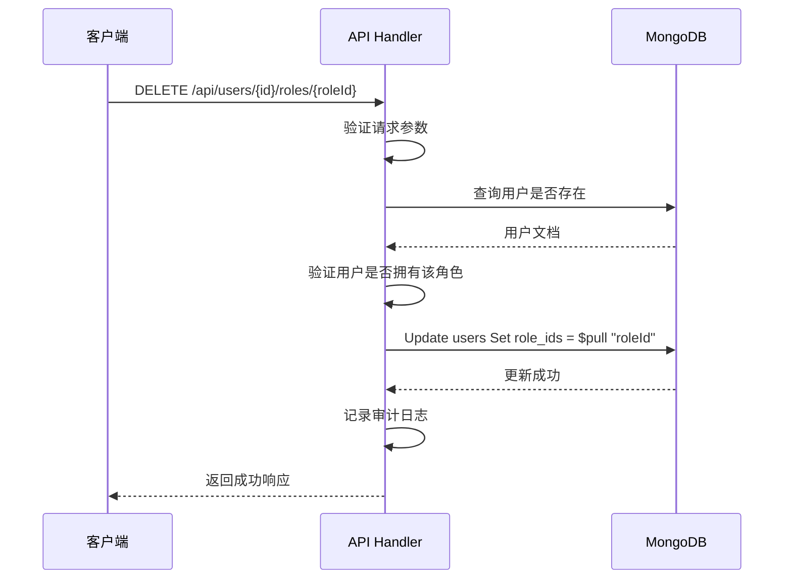

### 2.5 索引策略

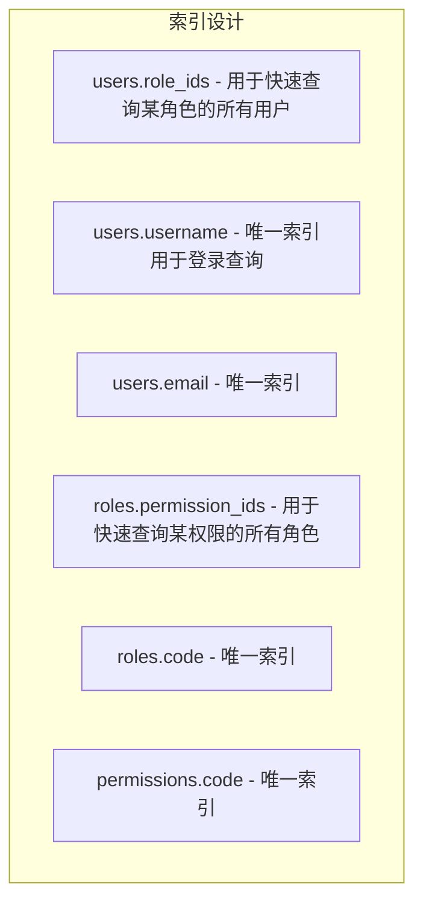

### 2.6 数据一致性维护

当删除角色或权限时，需要执行级联清理：

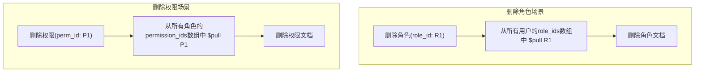

## 3. 权限分配工作流

### 3.1 用户角色分配工作流

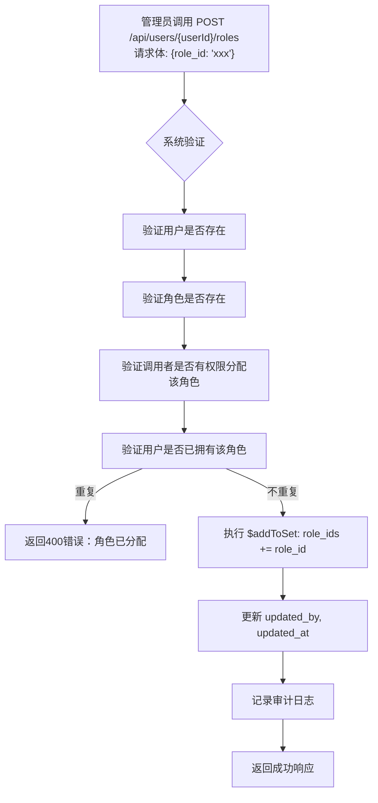

### 3.2 角色权限分配工作流

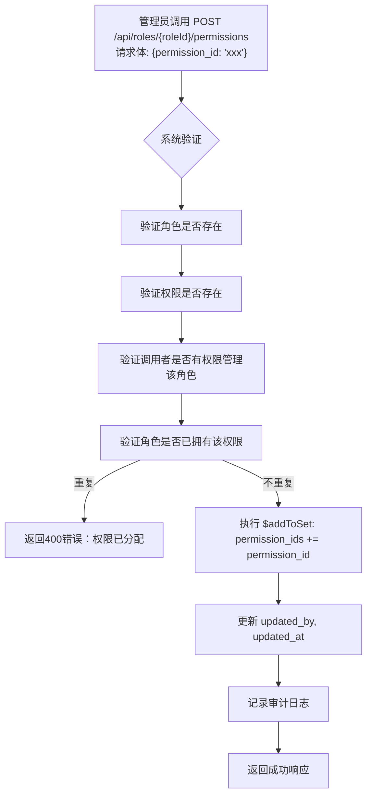

### 3.3 集合角色创建工作流

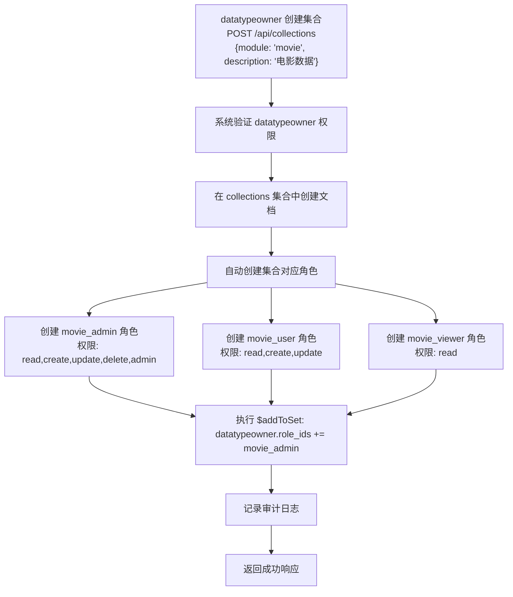

### 3.4 权限检查工作流

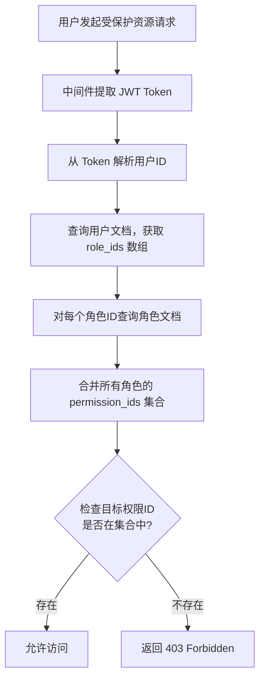

### 3.5 用户权限继承示意图

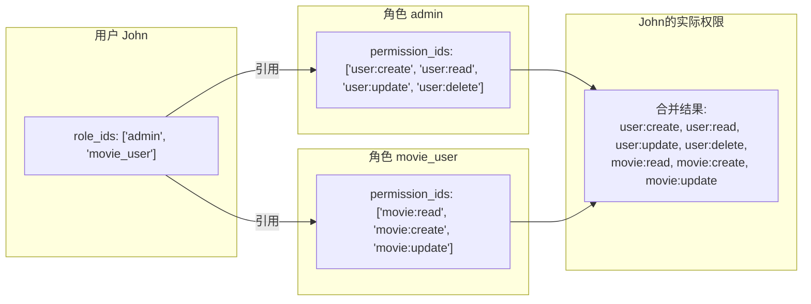

## 4. 功能点及验收标准

### 4.1 用户管理

| 功能点    | 描述                   | 验收标准               |
| ------ | -------------------- | ------------------ |
| 用户注册   | 创建新用户，设置用户名、密码和角色    | 成功创建用户，返回用户信息      |
| 用户登录   | 验证用户名和密码，生成JWT Token | 成功登录，返回Token和用户信息  |
| 用户列表   | 获取用户列表，支持分页和筛选       | 正确返回用户列表，支持分页      |
| 用户详情   | 获取单个用户详细信息           | 正确返回用户详情           |
| 更新用户   | 更新用户信息，包括角色和密码       | 成功更新用户信息           |
| 删除用户   | 删除指定用户               | 成功删除用户             |
| 分配角色   | 为用户分配角色（支持多角色）       | 成功分配角色，用户拥有角色权限    |
| 移除角色   | 从用户移除角色              | 成功移除角色，用户不再拥有该角色权限 |
| 获取用户角色 | 获取用户的角色列表            | 正确返回用户的角色列表        |
| 获取用户权限 | 获取用户通过角色继承的所有权限      | 正确返回用户的权限集合（去重）    |

### 4.2 权限管理

| 功能点  | 描述          | 验收标准          |
| ---- | ----------- | ------------- |
| 创建权限 | 创建新的权限      | 成功创建权限，返回权限信息 |
| 权限列表 | 获取权限列表，支持分页 | 正确返回权限列表，支持分页 |
| 权限详情 | 获取单个权限详细信息  | 正确返回权限详情      |
| 更新权限 | 更新权限信息      | 成功更新权限信息      |
| 删除权限 | 删除指定权限      | 成功删除权限        |

### 4.3 角色管理

| 功能点    | 描述             | 验收标准               |
| ------ | -------------- | ------------------ |
| 创建角色   | 创建新的角色         | 成功创建角色，返回角色信息      |
| 角色列表   | 获取角色列表，支持分页    | 正确返回角色列表，支持分页      |
| 角色详情   | 获取单个角色详细信息     | 正确返回角色详情           |
| 更新角色   | 更新角色信息         | 成功更新角色信息           |
| 删除角色   | 删除指定角色         | 成功删除角色             |
| 分配权限   | 为角色分配权限（支持多权限） | 成功分配权限，角色拥有权限      |
| 移除权限   | 从角色移除权限        | 成功移除权限，角色不再拥有该权限   |
| 获取角色权限 | 获取角色的权限列表      | 正确返回角色的权限列表        |
| 分配用户   | 为角色分配用户（支持多用户） | 成功分配用户，用户获得角色权限    |
| 移除用户   | 从角色移除用户        | 成功移除用户，用户不再拥有该角色权限 |
| 获取角色用户 | 获取角色的用户列表      | 正确返回角色的用户列表        |

## 5. API 接口

### 5.1 用户管理接口

- **POST /api/users**：创建用户
- **GET /api/users**：获取用户列表
- **GET /api/users/:id**：获取用户详情
- **PUT /api/users/:id**：更新用户
- **DELETE /api/users/:id**：删除用户
- **POST /api/users/:id/roles**：分配角色给用户
- **DELETE /api/users/:id/roles/:roleId**：从用户移除角色
- **GET /api/users/:id/roles**：获取用户的角色列表
- **GET /api/users/:id/permissions**：获取用户的权限列表

### 5.2 权限管理接口

- **POST /api/permissions**：创建权限
- **GET /api/permissions**：获取权限列表
- **GET /api/permissions/:id**：获取权限详情
- **PUT /api/permissions/:id**：更新权限
- **DELETE /api/permissions/:id**：删除权限

### 5.3 角色管理接口

- **POST /api/roles**：创建角色
- **GET /api/roles**：获取角色列表
- **GET /api/roles/:id**：获取角色详情
- **PUT /api/roles/:id**：更新角色
- **DELETE /api/roles/:id**：删除角色
- **POST /api/roles/:id/permissions**：分配权限给角色
- **DELETE /api/roles/:id/permissions/:permissionId**：从角色移除权限
- **GET /api/roles/:id/permissions**：获取角色的权限列表
- **POST /api/roles/:id/users**：分配用户给角色
- **DELETE /api/roles/:id/users/:userId**：从角色移除用户
- **GET /api/roles/:id/users**：获取角色的用户列表

## 6. 数据模型

### 6.1 用户表 (users)

| 字段名         | 数据类型          | 描述     | 约束                         |
| ----------- | ------------- | ------ | -------------------------- |
| \_id        | ObjectID      | 用户ID   | 主键                         |
| username    | String        | 用户名    | 唯一，必填                      |
| password    | String        | 密码     | 加密存储，必填                    |
| email       | String        | 邮箱     | 唯一，必填                      |
| role\_ids   | Array<String> | 角色ID列表 | 嵌入数组，通过$addToSet/$pull操作管理 |
| created\_by | String        | 创建者    | 必填                         |
| created\_at | DateTime      | 创建时间   | 自动生成                       |
| updated\_by | String        | 更新者    | 必填                         |
| updated\_at | DateTime      | 更新时间   | 自动生成                       |

### 6.2 权限表 (permissions)

| 字段名         | 数据类型     | 描述   | 约束    |
| ----------- | -------- | ---- | ----- |
| \_id        | ObjectID | 权限ID | 主键    |
| name        | String   | 权限名称 | 必填    |
| code        | String   | 权限代码 | 唯一，必填 |
| description | String   | 权限描述 | 可选    |
| created\_by | String   | 创建者  | 必填    |
| created\_at | DateTime | 创建时间 | 自动生成  |
| updated\_by | String   | 更新者  | 必填    |
| updated\_at | DateTime | 更新时间 | 自动生成  |

### 6.3 角色表 (roles)

| 字段名             | 数据类型          | 描述     | 约束                         |
| --------------- | ------------- | ------ | -------------------------- |
| \_id            | ObjectID      | 角色ID   | 主键                         |
| name            | String        | 角色名称   | 必填                         |
| code            | String        | 角色代码   | 唯一，必填                      |
| description     | String        | 角色描述   | 可选                         |
| permission\_ids | Array<String> | 权限ID列表 | 嵌入数组，通过$addToSet/$pull操作管理 |
| created\_by     | String        | 创建者    | 必填                         |
| created\_at     | DateTime      | 创建时间   | 自动生成                       |
| updated\_by     | String        | 更新者    | 必填                         |
| updated\_at     | DateTime      | 更新时间   | 自动生成                       |

## 7. 验证规则

### 7.1 用户验证规则

- 用户名唯一，不能重复
- 邮箱格式正确，唯一
- 密码至少8位，使用bcrypt加密
- 用户可以同时拥有多个角色

### 7.2 角色验证规则

- 角色代码唯一，不能重复
- 角色名称必填

### 7.3 权限验证规则

- 权限代码唯一，不能重复
- 权限名称必填

### 7.4 关联验证规则 - 嵌入方案B

- 同一用户-角色组合不能重复分配（通过$addToSet保证）
- 同一角色-权限组合不能重复分配（通过$addToSet保证）
- 删除角色时，需要从所有用户的role\_ids数组中移除该角色ID
- 删除权限时，需要从所有角色的permission\_ids数组中移除该权限ID

## 8. 错误处理

### 8.1 RBAC特定错误

| 错误类型  | 状态码 | 描述         | 处理方式        |
| ----- | --- | ---------- | ----------- |
| 角色不存在 | 404 | 指定的角色ID不存在 | 返回角色不存在错误信息 |
| 权限不存在 | 404 | 指定的权限ID不存在 | 返回权限不存在错误信息 |
| 用户不存在 | 404 | 指定的用户ID不存在 | 返回用户不存在错误信息 |
| 角色已分配 | 400 | 用户已拥有该角色   | 返回角色已分配错误信息 |
| 权限已分配 | 400 | 角色已拥有该权限   | 返回权限已分配错误信息 |
| 角色未分配 | 400 | 用户未拥有该角色   | 返回角色未分配错误信息 |
| 权限未分配 | 400 | 角色未拥有该权限   | 返回权限未分配错误信息 |
| 无权限   | 403 | 无权限执行该操作   | 返回无权限错误信息   |

